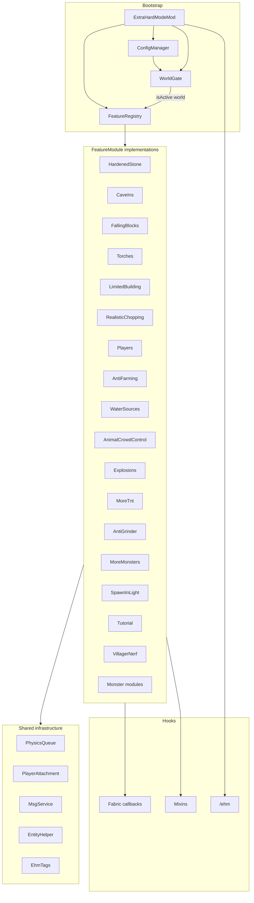
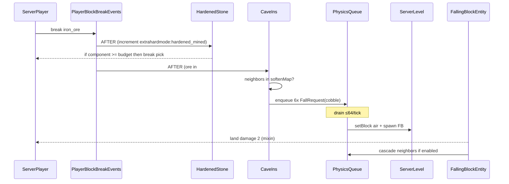
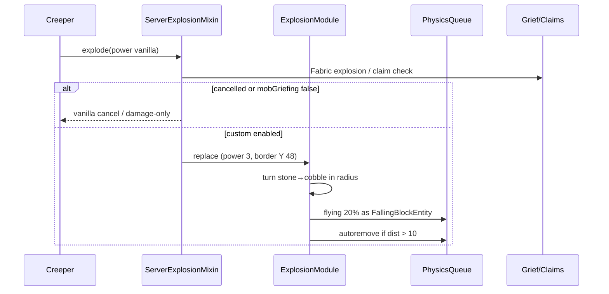

# Extra Hard Mode — Minecraft Java 26.2 Fabric Port

| Field | Value |
|---|---|
| **Title** | Extra Hard Mode for Minecraft Java 26.2 (Fabric) |
| **Author** | Grok Design |
| **Date** | 2026-08-31 |
| **Status** | Draft |
| **Target** | Minecraft Java Edition 26.2 (“Chaos Cubed”), Java 25 LTS |
| **Loader** | Fabric Loader 0.19.3+ / Fabric API **≥0.157.0+26.2** (example-mod pin `0.158.0+26.2` at implement time) |
| **License** | GNU Affero GPL v3.0 |
| **Mod ID** | `extrahardmode` |
| **Maven group** | `dev.extrahardmode` |
| **Java package** | `dev.extrahardmode` (do **not** use `com.extrahardmode`) |
| **Workspace** | `C:\client\grok\minecraft` (greenfield) |

---

## Overview

Vanilla Hard only punishes mistakes. Extra Hard Mode **changes the rules** so experts still have to think. Stone does not yield to cheap picks, caves collapse when you mine ore, torches fail in the deep, water sources cannot be bucket-cloned, and every mob has a trick. Every feature is togglable per world.

This document specifies a **greenfield Fabric mod** that reimplements every Extra Hard Mode mechanic for Minecraft Java 26.2. The original ([MLG-Fortress/ExtraHardMode](https://github.com/MLG-Fortress/ExtraHardMode), Bukkit slug `fun-hard-mode`) was a **server plugin** — it never ran in singleplayer. The port is a Fabric mod with `environment: "*"` and all game logic on the **logical server**, so it works in integrated singleplayer *and* on dedicated Fabric servers. That is a deliberate product upgrade.

Mechanics and source consultation make this a derivative work of Extra Hard Mode (AGPL-3.0-or-later; `LICENSE.txt` is AGPL-3.0; source headers allow “or later”; copyright Diemex 2013; original design Ryan “BigScary” Hamshire; later maintainers Diemex, RoboMWM, Mitsugaru). The port **must** ship AGPL-3.0-or-later, list those original authors as **authors** (port author secondary), **reimplement** against 26.2 / Fabric APIs, and **not** copy Java files verbatim.

AGPL conveying: shipping a jar is §6 (Corresponding Source — the public git repo satisfies this). AGPL §13 (network offer of source) applies to **modified** versions that users interact with over a network, not to unmodified public builds. The public `EhmApi` is AGPL-viral: any mod that compiles against it is AGPL. That will deter Create/claim-mod hooks. v1 accepts this; an LGPL-for-api-only split is **out of scope**.

---

## Background & Motivation

### Current state

Extra Hard Mode shipped September 2012. Last official-ish builds target 1.16–1.19 (`3.15.x`). The GitHub `pom.xml` currently compiles against Paper/Spigot API `26.1.2`, but the plugin was never rewritten as a client/Forge/Fabric mod. Canonical feature documentation is still the 3.4-SNAPSHOT gh-pages (`https://mlg-fortress.github.io/ExtraHardMode/` and `readme.md`).

The original is unusable for the product the user asked for:

- Bukkit/Paper only — no singleplayer, no Fabric servers, no Realms (and this port still will not run on Realms).
- World height, ore distribution, deepslate, copper tools, and the entire 1.18+ cave system have invalidated Y=30 “diamond depth” and Y=55 “caves” defaults.
- Later maintainers commented out Better Tree Felling in favor of the separate GraviTree plugin. This port **includes tree felling** (the original feature, not a soft-dep).
- The scoreboard-notifier tutorial (`de.diemex.scoreboardnotifier`) is a 2013 overlay hack. 26.2 has toasts, action bar, and advancement-style notifications.

### Pain points this port solves

1. **Singleplayer parity.** Survival challenge packs and YouTubers could never use EHM without a Bukkit server.
2. **26.2 world shape.** Hardened stone that ignores deepslate, copper picks, and Y=-64 bedrock is a broken port.
3. **Performance.** Cave-in physics was the original’s lag source. A budgeted queue is required, not a 1:1 Bukkit scheduler port.
4. **License clarity.** A mechanics+source port is AGPL. That has to be explicit before the first commit.

---

## Goals & Non-Goals

### Goals (v1.0)

- Reimplement **every** original Extra Hard Mode feature listed in the inventory below, with 26.2 block/tool/Y adaptations.
- Run in singleplayer (integrated server) and on dedicated Fabric servers.
- Per-world enable + per-module toggles.
- Datapack-friendly item/block **tags** for hardened blocks, cave-in ores, falling blocks, and soft torch surfaces.
- Hot-reloadable TOML config, Cloth Config + Mod Menu optional client screen.
- Game tests for the laggy/risky systems (cave-ins, torch deny, zombie reanimate, water sources).
- Ship on Modrinth + CurseForge under AGPL-3.0 with source in this workspace.

### Non-Goals (v1.0)

- NeoForge / Forge / Architectury multi-loader. Fabric-only. (Open Question: confirm.)
- New 26.x monster modules for Warden, Breeze, Creaking, Sulfur Cube, Copper Golem. Bogged may share the skeleton special-arrow table; that is the only analogue in v1.
- Invented mechanics around sulfur / cinnabar / geysers / potent sulfur. New stone-like blocks are **tag candidates** only.
- Cloning *Rebalance Villagers*. A **modest** diamond-gear trade nerf module may ship in v1 but is **default off** (not an original EHM feature; Open Question 4).
- Claim-plugin explosion checks (WorldGuard softdepend). SMP grief from EHM explosions/cave-ins on claimed land is a **stated v1 limitation** in the README.
- Teleport plugins (`/home`, `/back`, `/tpa`). Document incompatibility; do not implement.
- Cancelling totems of undying.
- Realms support (Fabric mods do not run on Realms).
- Depending on Sodium, Lithium, Iris, GraviTree, WorldGuard, or any other gameplay/render mod.
- Copying `com.extrahardmode.*` Java sources.

---

## Key Decisions

One table. Defaults = **current `RootNode` / live plugin code** unless a 26.2 remap or an explicit KD below says otherwise.

| # | Decision | Rationale |
|---|---|---|
| KD-1 | **Fabric-only**, `environment: "*"`, logic on the logical server | Original was server-side. Fabric is the recommended 26.2 loader (Loader 0.19.3+, FAPI ≥0.157.0+26.2). NeoForge `26.2.0.75` exists; we are not claiming it is unusable — we are not targeting it in v1. Architectury doubles mixin/event work. |
| KD-2 | **Package `dev.extrahardmode`**, mod id `extrahardmode` | Avoid impersonating upstream `com.extrahardmode`. |
| KD-3 | **AGPL-3.0-or-later**, original authors in `authors`, reimplement don’t copy | Derivative work. API is AGPL-viral; LGPL-for-api split is out of v1. |
| KD-4 | **Gamerule is the only enable switch.** First-apply is **per dimension**: if that level has no `ehm_applied` marker, copy the global TOML `enabledByDefault` into **that** level’s gamerule and stamp the marker. Never a save-global `initialized` bit. | Nether/End often load after Overworld; a save-wide flag leaves them at gamerule default `false`. TOML is the source for the copy (codec default `!isDedicatedServer()`); do not hardcode dedicated=false at apply time. |
| KD-5 | **Two Y bands, not five.** Cave band **Y=48** for more-monsters, spawn-in-light, horse chests, creeper TNT-drop, explosion border. Deep band: torch cutoff **Y=0**, blaze near-bedrock **Y≤-56**. Disable a Y-gate with a boolean, never world-min. | Original used ~50–55 as one “caves vs surface” line. Splitting horse/TNT to Y=0 left 1.18 caves unguarded. Torch/blaze still track diamond-depth / bedrock. |
| KD-6 | **Hardened = stone + deepslate + tuff.** Same tool budgets on all three. Copper interpolated; **do not halve deepslate.** | Tuff is the 1.18+ deepslate-layer filler; leaving it unhardened is a branch-mine escape hatch. Vanilla deepslate is already 2× stone time. Copper veins + tuff-tunnel would dominate 26.2 mining otherwise. 2013 32/64 lives in comments as `legacyHarshBudgets`. |
| KD-7 | **Ender Dragon auto-respawn default OFF** | Vanilla crystal ritual owns respawn. EHM extras stay on. |
| KD-8 | **Include RealisticChopping in v1** (no GraviTree dep) | User asked for all original features; specify a real BFS algorithm, exclude nether stems by default. |
| KD-9 | **Villager-trade nerf module exists, default OFF** | Not original EHM. Optional until the user answers Open Question 4. |
| KD-10 | **TOML keyed by dimension id**, stored under the overworld save; one gamerule | Hundreds of nodes. 26.1+ layout is `dimensions/minecraft/{overworld,the_nether,the_end}/` — no `DIM-1`, no folder-name matching. |
| KD-11 | **Mixins only where Fabric API is insufficient** | See mixin table. Client prediction needs a real sync payload. |
| KD-12 | **Physics: 64 conversions/tick/world AND 128 live EHM falling entities** | Conversions ≠ entities. 26.2 reworked entity drag/bounciness/friction; uncapped FallingBlockEntity is a hitch. Overflow: instant `setBlock` (no entity). |
| KD-13 | **Falling-block torch-break default OFF** | Upstream documented buggy. Implement, default `false`. |
| KD-14 | **Tutorial = toast + action bar**, never scoreboard | Client toasts need a packet. Persist shown-count in attachments. |
| KD-15 | **Deep Dark biome (not only Ancient City structure) is a physics + extra-spawn skip.** Trial Chambers too. | KD-15 previously undercut itself. Sculk shriekers outside the city piece still must not cave-in. |
| KD-16 | **Bogged shares skeleton special-projectile table; no other 26.x mob tricks in v1** | Mixin on `AbstractSkeleton` **filters** to Skeleton + Bogged (not stray, not wither skeleton). |
| KD-17 | **Tool budgets = current RootNode** `iron@128 / diamond@512 / netherite@1024`; copper **97** (`Math.round(128 * 190 / 250.0)`); budget N means **N breaks** via component counter. | Docs-era 32/64 plus invented deepslate-halving is harsher than master. Component counter, not extra-durability-plus-vanilla-1. See §1. |
| KD-18 | **Restore falling-block player damage = 2** (docs). Mixin **strictly gated** to `#extrahardmode:extra_falling` ∪ cave-in-softened. Anvils, dripstone, sulfur spikes stay vanilla. | Same class of “commented out of RootNode” as tree felling. User asked for the walkthrough feel; logs/blocks hurting you is a signature memory. Not a blanket `causeFallDamage` override. |
| KD-19 | **Cave Y = 48** (sea-level − 15). See KD-5. | One number for every “this is a cave” gate. |
| KD-20 | **Tuff is default-hardened** (stone-group budget). Granite/diorite/andesite/calcite/sulfur/cinnabar are not. | Closes the 26.2 tunnel exploit without turning every 1.16 stone variant into EHM stone. |
| KD-21 | **Spawn replacement is spawn-time only.** Mixin at `NaturalSpawner` spawn site (Lithium fail-soft). Persistent `ehm:spawn_processed` attachment stamped **before** the roll. Never on `CHUNK_GENERATION` / chunk reload. | `ENTITY_LOAD` re-rolls or skips. See SpawnReplaceService. |

---

## Proposed Design

### Product shape

```
┌─────────────────────────────────────────────────────────────┐
│ Client (optional extras)                                    │
│  Cloth Config screen · Mod Menu button · toasts · particles │
│  sounds (fizz, ghast shriek) · placement deny ghost-block   │
└───────────────────────────┬─────────────────────────────────┘
                            │ Fabric networking (config sync
                            │ of display-only bits; no logic)
┌───────────────────────────▼─────────────────────────────────┐
│ Logical server (integrated OR dedicated)                    │
│  ExtraHardModeMod.onInitialize()                            │
│    FeatureRegistry · WorldGate · ConfigManager · Commands   │
│    PhysicsQueue · PlayerData (Attachments) · MsgService     │
│    Mixins (destroy speed, water, falling dmg, …)            │
└─────────────────────────────────────────────────────────────┘
```

`fabric.mod.json`:

```json
{
  "schemaVersion": 1,
  "id": "extrahardmode",
  "version": "${version}",
  "name": "Extra Hard Mode",
  "description": "Vanilla Hard only punishes mistakes. Extra Hard Mode changes the rules so experts still have to think.",
  "authors": [
    "Ryan 'BigScary' Hamshire (original)",
    "Diemex",
    "RoboMWM",
    "Mitsugaru",
    "Grok Design (26.2 Fabric port)"
  ],
  "license": "AGPL-3.0-or-later",
  "environment": "*",
  "entrypoints": {
    "main": ["dev.extrahardmode.ExtraHardModeMod"],
    "client": ["dev.extrahardmode.client.ExtraHardModeClient"],
    "modmenu": ["dev.extrahardmode.client.ModMenuIntegration"],
    "fabric-gametest": ["dev.extrahardmode.test.EhmGameTests"]
  },
  "mixins": ["extrahardmode.mixins.json"],
  "depends": {
    "fabricloader": ">=0.19.3",
    "fabric-api": ">=0.157.0+26.2",
    "minecraft": "26.2",
    "java": ">=25"
  },
  "suggests": {
    "modmenu": "*",
    "cloth-config": "*"
  }
}
```

Dedicated servers load `main` + mixins and skip client extras. **Do not mixin render.** Sodium/Iris versions for 26.2 are **unverified** at design time; compatibility is “no render mixins,” not a version pin.

### Build

Copy **fabric-example-mod `26.2` `gradle.properties`** as the pin source of truth at implement time. Expected (verify against that repo on day one):

| Pin | Version |
|---|---|
| Minecraft | `26.2` exact (data 4903, protocol 776, Java 25). Do not use `~26.2` — Loader semver may reject 26.2.x patches or accept snapshots. |
| Fabric Loader | 0.19.3 (example-mod) |
| Fabric API | **`>=0.157.0+26.2`** (Permissions API non-experimental). Prefer example-mod’s `0.158.0+26.2`. |
| Fabric Loom | 1.17.x (`1.17-SNAPSHOT` on example-mod) |
| Gradle | 9.5.1 / 9.6 |
| Mappings | Official Mojang names (obfuscation removed late 2025) |
| Cloth Config | **unverified for 26.2.** `compileOnly` + `suggests`. If no 26.2 artifact resolves, ship without a screen in v1. Do not invent `26.2.155`. |
| Mod Menu | optional, whatever resolves for 26.2 |
| Night Config | `com.electronwill.night-config:toml` (server-safe; no Cloth needed to load TOML) |

`build.gradle.kts` **must** include:

```kotlin
loom {
    splitEnvironmentSourceSets()
    mods {
        register("extrahardmode") {
            sourceSet(sourceSets.main.get())
            sourceSet(sourceSets.named("client").get())
        }
    }
}
```

Without that block, `src/client` is not a remapped client source set.

Mixin `compatibilityLevel`: **`JAVA_25`** (class-file version must match `--release 25`). Confirm Loom 1.17 / Mixin accepts `JAVA_25` in PR 1; if the enum is missing, that is a Loom bump, not a silent `JAVA_21`.

Gradle Kotlin DSL. No Bukkit, no Paper.

### Repo layout

```
C:\client\grok\minecraft\
  settings.gradle.kts
  build.gradle.kts
  gradle.properties
  gradle/wrapper/
  LICENSE                  # AGPL-3.0-or-later full text
  README.md
  NOTICE                   # credits: BigScary, Diemex, RoboMWM, Mitsugaru
  src/main/java/dev/extrahardmode/
    ExtraHardModeMod.java
    api/                   # stable events for other mods
    command/
    config/
    feature/               # FeatureModule registry + world/farming/player
    feature/monster/
    mixin/
    module/                # PhysicsQueue, PlayerData, MsgService, EntityHelper
    task/                  # scheduled logical-server tasks
    world/                 # WorldGate, tags helpers, structure exclusion
  src/main/resources/
    fabric.mod.json
    extrahardmode.mixins.json
    assets/extrahardmode/  # lang/en_us.json only (v1 uses vanilla sound events; no sounds.json)
    data/extrahardmode/
      tags/block/
      tags/item/
      tags/worldgen/biome/
      tags/worldgen/structure/
  src/client/java/dev/extrahardmode/client/
  src/client/resources/
  src/gametest/java/dev/extrahardmode/test/
  src/test/java/dev/extrahardmode/  # JUnit 5, no Minecraft
```

Use **item/block/biome/structure tags** for every list the original stored as `Material` names. Datapacks can extend or replace them without forking the mod.

### Module architecture



`FeatureModule` (new, do not port `ListenerModule` as-is):

```java
public interface FeatureModule {
    Identifier id();                 // extrahardmode:hardened_stone
    BooleanConfigKey enabledKey();   // per-world toggle, generated from TOML schema
    default void bootstrap(FeatureBus bus) {}  // register events THROUGH the bus
    default void onWorldLoad(ServerLevel level, WorldConfig cfg) {}
    default void onWorldUnload(ServerLevel level) {}
    default void serverTick(ServerLevel level, WorldConfig cfg) {}
}
```

**WorldGate is enforced by the registry, not by hope.** Modules do not register Fabric callbacks directly. They register on `FeatureBus`, which wraps every invocation:

```java
public final class FeatureBus {
    public <T> void listen(Event<T> event, Identifier moduleId, T handler) {
        event.register((proxy) -> {
            ServerLevel level = extractLevel(proxy);
            if (level != null && !WorldGate.isModuleActive(level, moduleId)) return defaultPass(proxy);
            return handler.invoke(proxy);
        });
    }
}
```

`WorldGate.isModuleActive(level, id)` = gamerule on **and** module toggle on. A missed early-return cannot enable cave-ins in a disabled world. Mixins call the same `isModuleActive` at the top of every inject (cannot go through FeatureBus). PR 1 ships a unit-testable `WorldGate` + a mixin audit comment: “every mixin inject’s first statement is a WorldGate check.”

Bypass (creative / permissions / `/ehm bypass`) is checked inside **player-triggered** handlers only — world physics still runs.

`BooleanConfigKey` / `WorldConfig` are generated from the schema table in Appendix A (Night Config codec, Cloth binding via optional `ConfigEntryBuilder` if Cloth resolves). Hot reload invalidates the per-dimension `WorldConfig` cache and resends `ClientboundSyncPayload`.

### World enablement (WorldGate)

**Single source of truth:** gamerule `extrahardmode:enabled` on that `ServerLevel`. Nothing else (no folder-name lists, no `disabledDimensions`).

```java
public static final GameRule<Boolean> ENABLED = GameRuleBuilder
    .forBoolean(false) // vanilla-style default; first-boot copies enabledByDefault over this
    .category(GameRuleCategory.MISC)
    .buildAndRegister(Identifier.fromNamespaceAndPath("extrahardmode", "enabled"));

public static boolean isActive(ServerLevel level) {
    return level.getGameRules().get(ENABLED);
}
```

**First-apply is per dimension** (PR 2, `ServerWorldEvents.LOAD` for **every** `ServerLevel`, including nether/end on first portal and custom dims):

`SavedData` `extrahardmode_boot` in the **overworld** save (`data/extrahardmode_boot.dat`):

```
applied: Set<ResourceLocation>   // dimensions we have already first-applied; NOT a single initialized bit
```

On each `ServerWorldEvents.LOAD(level)`:

1. `id = level.dimension().location()`.
2. If `applied.contains(id)`: **return**. Never overwrite a gamerule the player (or a previous apply) already owns.
3. Resolve the value **from TOML**, not from `isDedicatedServer()` at apply time:
   - `enabledByDefault` is a global TOML boolean.
   - Codec / missing-key **default** is `!server.isDedicatedServer()` (SP `true`, dedicated `false`). Operators may set `enabledByDefault = true` on dedicated for new worlds; that must stick.
   - Vanilla overworld / nether / end: `value = globalConfig.enabledByDefault`.
   - **Custom dimensions:** inherit the **overworld’s current gamerule** if overworld is loaded; else `enabledByDefault`. (A player who turned Overworld off does not get EHM sprung on a new datapack dim.)
4. `level.getGameRules().set(ENABLED, value)`; `applied.add(id)`; persist.
5. Toast once for overworld: “Extra Hard Mode is {on/off}. `/gamerule extrahardmode:enabled`.” Nether/end/custom: log `INFO`, no extra toast spam.

Adding the mod to an existing singleplayer world therefore turns EHM **on in Overworld and, when those dimensions first load, Nether and End** (SP TOML default). Dedicated stays **off** per dimension until an op flips that dimension’s gamerule *or* sets `enabledByDefault = true` before first load.

GameTest (PR 2): create a save, load overworld only, assert overworld gamerule matches TOML; then load nether; assert nether matches TOML and overworld was not rewritten.

Worlds are keyed **only** by `ServerLevel.dimension().location()` (`minecraft:overworld`, `minecraft:the_nether`, `minecraft:the_end`, custom dims). 26.1+ stores default dimensions under `dimensions/minecraft/{overworld,the_nether,the_end}/`. `DIM-1` / `world_nether` / folder-name matching are **not used**.

End is a normal dimension: the gamerule applies independently so no-build-in-End works when End is enabled. Operators who want Overworld-only turn the End gamerule off.

### Config

Two layers, both TOML (Night Config). JSONC is rejected: comments matter, Cloth Config speaks TOML/HOCON well, and the original was commented YAML.

**Global** `config/extrahardmode.toml` — `enabledByDefault`, debug, physics budgets, permission flags, default module values copied into a new save. **No metrics key** (v1 ships no bStats).

**Per-dimension** files live in the **overworld save**, never beside `DIM-1`:

```
<overworld save>/data/extrahardmode/minecraft/overworld.toml
<overworld save>/data/extrahardmode/minecraft/the_nether.toml
<overworld save>/data/extrahardmode/minecraft/the_end.toml
<overworld save>/data/extrahardmode/<namespace>/<path>.toml   # custom dims
```

Created on first boot from global defaults. Key = `dimension().location()` path. Verify against a 26.2 dedicated save in PR 2.

Hot reload: `/ehm reload` (`extrahardmode.admin`). Reloads TOML on the **server thread** (Night Config, no async), invalidates `WorldConfig` cache, resends `ClientboundSyncPayload` to all players. Datapack tags still reload with vanilla `/reload`.

`/ehm set <module> <bool>` (extra vs original command set) writes the per-dimension TOML via `ConfigManager.save(level)` on the server thread, then reloads that dimension only.

Schema: Night Config → `WorldConfig` record. Appendix A is the full key list (RootNode path → TOML key → type → default). Cloth binds the same record if the artifact resolves.

`configVersion = 1`. Old Bukkit `config.yml` dropped in the folder: log “unsupported” — do not parse YAML.

### Y and depth remap table

**Cave band = 48** (sea 63 − 15). Original ~50–55 was one “caves vs surface” line; we keep one line. **Deep band** is torch (diamond-depth analogue) and blaze (bedrock analogue) only.

| Feature | Original (RootNode) | 26.2 default | Band |
|---|---|---|---|
| World height | Y=0..255 | **Y=-64..320** | — |
| More monsters Max Y | 55 | **48** | cave |
| Spawn-in-light Max Y | **50** (docs 55) | **48** | cave |
| Spawn-in-light Max Light | 10 | **10** | — |
| Horse chest block below | 55 | **48** | cave |
| Creeper TNT-drop Max Y | 50 | **48** | cave |
| Explosion border Y | 55 | **48** | cave |
| Torches no-placement under Y | 30 | **0** | deep |
| Blaze near-bedrock | ~Y=0 | **Y ≤ -56** | deep (and **not** Deep Dark biome) |
| Sea level | 63 | **63** | — |

**Disable sentinel:** every Y-gate has a sibling boolean (`torches.noPlacement.enable`, `monsters.more.enable`, …). **Do not** use `0`, `-64`, or world-min as “off” — `0` is a valid 26.2 torch cutoff and `-64` is “only bedrock.” Custom dimension heights would also break a world-min sentinel. `Integer.MIN_VALUE` is accepted in TOML as a belt-and-suspenders off for integer fields, but the boolean is canonical.

Original numbers stay in comments (`# original: 30`). Alternative considered (not chosen): `Y_new = Y_old + worldMin` (30 → -34). That blindly offsets; it does not track diamond-depth or cave-vs-surface intent.

### 26.2-era content policy

**Must-adapt** (v1):

- Hardened blocks: stone + deepslate + **tuff** (KD-20). Calcite / granite / diorite / andesite / sulfur / cinnabar optional via tags, **default off**.
- Tool budgets: copper, iron, diamond, netherite (and any datapack pick in the item tag).
- Cave-in ores: all vanilla ore *and* deepslate variants, copper ore, ancient debris.
- Softened deepslate → cobbled deepslate (not cobblestone).
- Torch Y cutoff remapped (table above).
- Falling-block list updated to 26.2 names (`grass_block` not `GRASS`, `mycelium` not `MYCEL`).
- Waterlogged blocks + cauldrons handled for the infinite-water fix.
- Copper Age tools exist; they are first-class in the budget table.

**Must-not-break** (v1):

- **Deep Dark biome** (`minecraft:deep_dark`): no spawn replacements, no spawn-in-light, no more-monsters packs, **no cave-ins / extra falling conversions** (the whole biome, not only Ancient City structure pieces — sculk shriekers/catalysts outside the city are still Deep Dark).
- **Ancient Cities / Trial Chambers** (structure tags): additionally skip physics and extra-spawns if a datapack moves those structures out of Deep Dark.
- **Trial spawners / raid / ominous events / spawn eggs:** never replaced, never anti-grinder-spawn-blocked.
- Respect `mobGriefing`, `doMobSpawning`, `keepInventory`, `doFireTick`, `tntExplodes`.

**Out of v1** (appendix only):

- Warden, Breeze, Bogged (except sharing skeleton projectile table), Creaking, Copper Golem, Sulfur Cube tricks.
- New EHM mechanics around sulfur, cinnabar, potent sulfur, geysers, sulfur spikes.
- Sulfur/cinnabar are **tag candidates** for hardened/falling lists (default: not hardened, not falling). Operators who want sulfur caves to cave-in can add them via datapack.

### Physics queue (performance)

Original `BlockPhysicsCheckTask` ran unbounded neighbor walks. That is the lag source.

```
PhysicsQueue per ServerLevel:
  budgetConversionsPerTick = 64          # enqueue → spawn-or-setBlock attempts
  maxLiveEhmFallingEntities = 128        # live FallingBlockEntity we spawned
  maxFloodFillPerConversion = 16
  maxQueueDepth = 4096                   # drop oldest; metric ehm_physics_dropped
  skip if !level.hasChunk(x, z) || !level.areEntitiesLoaded(pos)
  skip if biome in #extrahardmode:no_physics (default: deep_dark)
  skip if structure in #extrahardmode:physics_protected_structures
  skip if block in #extrahardmode:physics_protected
```

Drain at `ServerTickEvents.END_WORLD_TICK`. If live EHM falling-entity count ≥ 128, remaining conversions this tick **set the block directly** (no entity, no player damage, no cascade this tick) — the world does not hitch on 26.2’s reworked drag/bounciness/friction. Falling blocks are not `LivingEntity`, so vanilla entity-cramming (24) does not cap them; our cap does.

26.2 entity physics (air drag, bounciness, friction) applies to our `FallingBlockEntity` as vanilla; we do not mixin those attributes.

Quantified: 4-vein coal (24 conversions) < 64. TNT crater ~80 blocks / 2 ticks. 16-block copper blob GameTest (PR 13) asserts queue depth < 4096 and no tick timeout. Stress: 20-chunk TNT cannon → `physics_dropped` > 0, log WARN, no watchdog kill.

If `physics_dropped > 0` in survival: lower TNT spam, set `explosions.flyingBlocks = false`, or raise `maxFallingConversionsPerTick`. Spark is the external profiler; we do not bundle it.

### SpawnReplaceService (KD-21)

**Do not use `ServerEntityEvents.ENTITY_LOAD`.** That fires on every add-to-world, including chunk re-entry. Spawn type is not on vanilla NBT after restart.

```
SpawnReplaceService.replaceIfNeeded(Mob mob, ServerLevel level, EntitySpawnReason reason):
  if !WorldGate.isModuleActive: return
  if mob.getAttached(EHM_SPAWN_PROCESSED) == true: return   // chunk reload / already rolled
  mob.setAttached(EHM_SPAWN_PROCESSED, true)                // stamp FIRST, persistent
  if reason != NATURAL: return                              // never CHUNK_GENERATION, STRUCTURE,
                                                            // SPAWNER, TRIAL_SPAWNER, REINFORCEMENTS,
                                                            // SPAWN_EGG, COMMAND, DISPENSER, BREEDING,
                                                            // CONVERSION, LOAD
  if biome in #no_spawn_replacements: return                // deep_dark
  if inside #no_spawn_replacement_structures: return        // ancient_city, trial_chambers
  roll module-specific replacement; if hit:
      discard original; spawn replacement with reason EVENT
      stamp EHM_SPAWN_PROCESSED on the new mob too
```

**Hook (spawn-time only):**

1. Primary: mixin inject at `NaturalSpawner`’s `EntityType.spawn(...)` / `spawnCategoryForPosition` call site, **after** the mob exists, **before** it is fully added, with `EntitySpawnReason.NATURAL`.
2. Lithium fail-soft: `injectors.defaultRequire = 0` on that inject. If it does not apply, log WARN once and use Fabric `ServerEntityEvents.ALLOW_ADD` (26.2 FAPI; fires before add-to-level) **only when** `EntitySpawnReason` is `NATURAL` (scoped `ENTITY_LOAD_REASON` if present). If neither hook exists, disable replacements and log — do not fall back to `ENTITY_LOAD`.
3. Never replace during worldgen (`CHUNK_GENERATION`) — expensive and races structure processors.

GameTest (PR 13): spawn a tagged processed zombie, unload/reload the chunk, assert it is still a zombie (not a witch/spider) and attachment still true.

### Client sync (not “display-only bits”)

Dedicated-server ghost-place is real for torch Y, ore-next-to-stone, and limited building. v1 ships a payload:

```java
public record ClientboundSyncPayload(
    boolean limitedBuilding,
    boolean torchSoftDeny,
    int torchNoPlacementUnderY,      // ignored if !torchYDeny
    boolean torchYDeny,
    List<Identifier> hardenedBlocks, // or hash of the tag snapshot
    List<Identifier> hardenedPicks,
    List<Identifier> caveInOres,
    List<Identifier> softTorchSurfaces,
    List<Identifier> depthLimitedLights
) implements CustomPayload { public static final Identifier ID = id("sync"); }
```

- Sent on `ServerPlayConnectionEvents.JOIN` and on `/ehm reload`.
- Codec: `ByteBufCodecs` / `StreamCodec` registered in `onInitialize` (server) and `onInitializeClient`.
- Client mixins (destroy speed, torch predict, place-deny) **read only this payload**, never the TOML.
- Tutorial toasts: separate `ClientboundToastPayload(messageId)` — `SystemToast` is client-only.

---

## Feature Inventory

Every original feature. **Defaults = current `RootNode` / live plugin code** unless a 26.2 remap or an explicit KD says otherwise. Docs-vs-source disagreements are called out per node, not with a global “docs win” policy.

### Mining / world

#### 1. Inhibit tunneling / hardened stone

**Original:** Cheap picks barely work on configured hardened blocks (default `STONE`). Tools not in the list cannot mine it. Tools in the list are consumed after N blocks.

Current `RootNode.DefaultToolDurabilities`: `IRON_PICKAXE@128`, `DIAMOND_PICKAXE@512`, `NETHERITE_PICKAXE@1024` (commented-out 32/64 still in the file — 2013 docs). **v1 ships 128/512/1024 (KD-17).** `legacyHarshBudgets` in comments is the 32/64 table for operators who want 2013 pain.

**26.2 tag `#extrahardmode:hardened` (KD-6, KD-20):**

```json
{ "values": ["minecraft:stone", "minecraft:deepslate", "minecraft:tuff"] }
```

Not default: granite, diorite, andesite, calcite, sulfur, cinnabar (datapack-addable). Tuff is the deepslate-layer filler; leaving it out is a tunnel exploit.

**One budget group** for all hardened blocks. Vanilla deepslate hardness 3.0 already doubles mine time vs stone 1.5; we do **not** silently halve the budget.

| Tool | Vanilla durability | Budget (hardened blocks until pick is consumed) |
|---|---|---|
| Wooden / gold / not in list | — | **cannot harvest** (see truth table) |
| `minecraft:copper_pickaxe` | **190** | **97** = `Math.round(128 * 190 / 250.0)` (`97.28` → 97; not 96) |
| `minecraft:iron_pickaxe` | 250 | **128** |
| `minecraft:diamond_pickaxe` | 1561 | **512** |
| `minecraft:netherite_pickaxe` | 2031 | **1024** |

**Budget N means N breaks**, not N−ε after vanilla damage. Implementation: item stack component `extrahardmode:hardened_mined` (int). On each successful hardened harvest with a listed pick, increment; when `>= budget`, `hurtAndBreak` the remaining durability (break the tool). Component copies on stack split. Creative never increments.

**Truth table** (survival / adventure). Creative: instant-break, no drain, bypass. Spectator: no-op.

| Tool in budget list? | `canHarvest` | Destroy speed | Drop | Extra component |
|---|---|---|---|---|
| Yes | vanilla (pick vs stone) | vanilla | vanilla (silk/fortune allowed) | +1 toward budget |
| No | **false** | **0** (bar never completes; not “30s then drop”) | none | none |

“Cannot mine” and “30s” cannot both be true — we pick **speed 0 + no harvest**. The client mixin mirrors this from `ClientboundSyncPayload` so the overlay does not lie.

Create/drills: `PlayerBlockBreakEvents.AFTER` still increments the component if the broken block is hardened and the tool is listed. If a drill bypasses the player break event, that is a known gap **and** a GameTest (“Create not present → pass; if present, assert drain”).

Also:

- **Block placing ore next to stone** (`true`): `UseBlockCallback` cancel if placed block is in `#extrahardmode:cave_in_ores` and any neighbor is `#extrahardmode:hardened`. Tutorial message `no_placing_ore_against_stone`.
- **Block piston-moving stone** (`true`): mixin `PistonBaseBlock` / `PistonStructureResolver` — if any pushed block is hardened or a cave-in ore, cancel the move. (Original blocked stone *and* ore.)
- Event `EhmHardenedStoneEvent` analogue: `dev.extrahardmode.api.event.HardenedStoneMineEvent` (cancellable) so other mods can allow silk-touch drills.

**Mixin:** `Player.getDestroySpeed` + harvest check (`hasCorrectToolForDrops` / `canHarvestBlock`) so unlisted tools are speed 0 and non-harvesting. Listed tools: vanilla speed; budget via the component on `PlayerBlockBreakEvents.AFTER`. Client mixin mirrors from the sync payload.

Silk Touch / Fortune: still allowed; budget still consumes. Original behavior.

**Alternative considered (not v1):** overlay `minecraft:tool` component `damage_per_block` to avoid the destroy-speed mixin. Data-driven, but unlisted tools still need a harvest/speed mixin, silk/fortune must not reset the overlay, and drills often ignore components. Revisit if the mixin conflicts.

#### 2. Cave-ins

**Original:** Mining configured ores softens surrounding stone into cobble/dirt which then falls like sand and can hurt the player. TNT also softens stone. `Apply Physics To Weakened Stone: true`.

Default ores (source): coal, iron, gold, lapis, redstone, emerald, diamond. Stone relation: `STONE → COBBLESTONE`.

**26.2 tag `#extrahardmode:cave_in_ores`:**

```json
{ "values": [
  "minecraft:coal_ore", "minecraft:deepslate_coal_ore",
  "minecraft:iron_ore", "minecraft:deepslate_iron_ore",
  "minecraft:gold_ore", "minecraft:deepslate_gold_ore",
  "minecraft:lapis_ore", "minecraft:deepslate_lapis_ore",
  "minecraft:redstone_ore", "minecraft:deepslate_redstone_ore",
  "minecraft:emerald_ore", "minecraft:deepslate_emerald_ore",
  "minecraft:diamond_ore", "minecraft:deepslate_diamond_ore",
  "minecraft:copper_ore", "minecraft:deepslate_copper_ore",
  "minecraft:nether_gold_ore", "minecraft:nether_quartz_ore",
  "minecraft:ancient_debris"
]}
```

Ancient debris only softens `#hardened` neighbors (netherrack is not hardened by default).

**Copper balance (KD-6 risk):** copper veins are large and common; 6 neighbors × 100% would be a cave-in festival. For `copper_ore` and `deepslate_copper_ore` only, each neighbor softens with **50%** chance. Other ores stay 100%. GameTest: break a 16-block copper blob, assert no tick timeout and `physics_dropped == 0` on a quiet world.

**26.2 tag `#extrahardmode:stone_to_cobble` (block pair via custom codec, not a vanilla tag):**

```toml
[[caveIns.softenMap]]
from = "minecraft:stone"
to   = "minecraft:cobblestone"
[[caveIns.softenMap]]
from = "minecraft:deepslate"
to   = "minecraft:cobbled_deepslate"
[[caveIns.softenMap]]
from = "minecraft:infested_stone"
to   = "minecraft:cobblestone"
[[caveIns.softenMap]]
from = "minecraft:infested_deepslate"
to   = "minecraft:cobbled_deepslate"
```

On `PlayerBlockBreakEvents.AFTER` of a cave-in ore (and on EHM explosions): enqueue 6-directional neighbors that match a `from` block. PhysicsQueue converts `from` → `to` as `FallingBlockEntity` if `applyPhysics: true`, else just set the block.

**Physics skip (KD-15):** biome `#extrahardmode:no_physics` (default `deep_dark`) **or** structure `#extrahardmode:physics_protected_structures` (default `ancient_city`, `trial_chambers`) **or** block `#extrahardmode:physics_protected`. Cave-ins do **not** run in Deep Dark at all.

#### 3. Additional falling blocks

**Original enable `true`.** Default list (source `DefaultFallingBlocks`): `DIRT`, `SHORT_GRASS`, `COBBLESTONE`, `MOSSY_COBBLESTONE`, `STONE_SLAB`, `COBBLESTONE_SLAB`, `MYCELIUM`. Docs also had `GRASS`, `DOUBLE_STEP@3`, `STEP@3,11`. Damage amount was in docs as `2` but **commented out of later `RootNode`**. Cascading `true`. Drop-as-item when obstructed `false`. Break-torches config `true` but documented buggy.

**26.2 tag `#extrahardmode:extra_falling`:**

```json
{ "values": [
  "minecraft:dirt", "minecraft:grass_block", "minecraft:mycelium",
  "minecraft:podzol", "minecraft:coarse_dirt", "minecraft:rooted_dirt",
  "minecraft:cobblestone", "minecraft:mossy_cobblestone", "minecraft:cobbled_deepslate",
  "minecraft:cobblestone_slab", "minecraft:stone_slab", "minecraft:cobbled_deepslate_slab",
  "minecraft:moss_block"
]}
```

Not default: sulfur, cinnabar, tuff, calcite, mud, clay (operators may add). Tuff is **hardened**, not extra-falling.

When a supporting block is removed or a falling block lands (`cascade: true`), enqueue. Grass/mycelium/podzol land as `dirt` (`turnGrassToDirt: true`).

**Damage (KD-18):** default **2** (docs; `MORE_FALLING_BLOCKS_DMG_AMOUNT` is commented out of live RootNode — we restore it as a Key Decision covering the same class of change as tree felling). **Mixin `FallingBlockEntity.causeFallDamage` is gated:** apply extra damage only if the falling block’s `BlockState` is in `#extra_falling` **or** is a cave-in-softened product (`cobblestone` / `cobbled_deepslate` spawned by PhysicsQueue). **Anvils, pointed dripstone, sulfur spikes stay vanilla** (no double-dip). Mark EHM-spawned falling entities with `EHM_OURS` attachment as a second gate.

**Break torches:** land handler; default **`false`** (KD-13).

#### 4. Torches

| Node | Original | 26.2 |
|---|---|---|
| No Placement Under Y | 30 | **0** (deepslate transition). |
| Enable | (implied by Y=0 disable) | **`torches.noPlacement.enable = true`**. Disable the feature with this boolean, **not** Y=0 or Y=-64. |

- **No placement on soft materials** `true`. Tag `#extrahardmode:soft_torch_surfaces`: dirt, grass_block, sand, red_sand, gravel, soul_sand, soul_soil, mud, clay, snow_block, moss_block, rooted_dirt, farmland, sulfur (loose), potting-style. Check the **clicked face’s block**, not the torch’s own block.
- **Rain breaks torches** `true`. On chunk random tick while raining: 1% chance per exposed torch in the chunk to drop as item. Any block above = covered = survives. Reuse `RemoveExposedTorchesTask` analogue, budgeted (max 16 torches/tick/world).
- **Sound:** lava fizz (`SoundEvents.LAVA_EXTINGUISH` / `BLOCK_FIRE_EXTINGUISH`) when placement is denied (`sounds.torchFizz: true`).
- Soul torches, redstone torches, lanterns, copper bulbs: **lanterns and copper bulbs are allowed below cutoff** (they are the intended expensive/creative alternatives the original docs named: glowstone, redstone torches, lava). Redstone torches **are allowed below cutoff** (original pitch: “dimmer redstone torches (spooky!)”). Soul torches: treat as regular torches (they are cheap). Configurable tag `#extrahardmode:depth_limited_lights` default `torch`, `wall_torch`, `soul_torch`, `soul_wall_torch`. Not: `redstone_torch`, `lantern`, `soul_lantern`, `copper_bulb`, `glowstone`, `shroomlight`, `sea_lantern`.

**Mixin:** `TorchBlock.canSurvive` is not enough (that’s attach-to-block). Placement deny is `UseBlockCallback` + client-side cancel so the ghost block doesn’t flicker. Server is authoritative.

#### 5. Campfires

`rainExtinguishesCampfires: false` (unchanged). Same chunk-rain pass as torches; set `CampfireBlock.LIT=false` rather than drop. Covered campfires survive.

#### 6. Breaking netherrack starts fire

`20%` (unchanged). `PlayerBlockBreakEvents.AFTER` on `netherrack` (and `nylium`? **no**, stay faithful: netherrack only). Place fire above if air. Punching that fire ignites the player — handled by “extinguishing fires ignites player”.

#### 7. Limited block placement

`true` (unchanged).

- **No straight pillaring:** cancel place if the placed block is directly under the player’s feet (`player.blockPosition().below()`) and the player is jumping / not on ground. Original: jump-place under feet.
- **No unsupported sky bridges:** cancel if the placed block has no solid neighbor except the one the player is standing on / the clicked face, and there is no support within 1 block below (branching out over air).

Bypass in creative. Tutorial message `realistic_building`.

Implementation: `UseBlockCallback` + `BlockEvents.USE_ITEM_ON`. No mixin required.

#### 8. Better tree felling (RealisticChopping)

**Must include.** Upstream hardcoded the feature off and pointed at GraviTree. v1 default **`true`**. Default-exclude `#minecraft:nether_stems` (crimson/warped) via tag `#extrahardmode:fellable_logs` = `#minecraft:logs` minus nether stems.

**Algorithm** (implement this, not “scan 30 for any leaf”):

```
tryFell(broken: BlockPos, player):
  state = level.getBlockState(broken)
  if state not in #extrahardmode:fellable_logs: return
  if player bypass: return

  // Same-wood group: the specific log tag this block is in
  // (oak_logs, spruce_logs, … jungle_logs, pale_oak_logs). If none, use the block id only.
  wood = matchingVanillaLogTag(state)  // e.g. #minecraft:jungle_logs

  // BFS through wood, 6-connected
  // Bounds: max 64 logs; dy in [-2, +30] from broken; Chebyshev xz from broken ≤ 2
  // (2 covers 2×2 jungle; 1×1 trunks stay tight)
  logs = BFS(broken, wood, max=64, maxUp=30, maxDown=2, maxChebyshevXz=2)
  if logs.size < 2: return  // lone post

  // Leaves must be the matching tree type AND adjacent (6-dir) to some log in the set
  leafTag = matchingLeavesTag(wood)  // oak_leaves, jungle_leaves, … (azalea special-case)
  adjacentLeaves = count 6-dir neighbors of any log in logs whose state is in leafTag
  if adjacentLeaves < 4: return  // player-built pillar with a decorative leaf nearby

  // Top-to-bottom, 1-tick delay between spawns to avoid FallingBlock collision
  for (i, pos) in logs.sortedBy(y desc, then x, then z):
      PhysicsQueue.enqueueFalling(pos, delayTicks=i, damage=fallingBlockDamage, ours=true)
```

GameTests (PR 6 + 13): (1) small oak falls; (2) 2×2 jungle falls as one tree; (3) acacia with a bend (xz within 2) falls; (4) **player-built log pillar, 8 high, with a leaf two blocks to the side — must NOT fell.**

#### 9. Sounds

| Sound | Default | Vanilla event |
|---|---|---|
| Torch fizz on deny | true | `minecraft:block.lava.extinguish` |
| Creeper TNT warning | true | `minecraft:entity.ghast.warn` (original: “Ghast shriek”) |

Played server-side via `level.playSound` so dedicated servers work. No custom sound assets required for v1.

---

### Mobs

All monster modules honor `WorldGate` (via FeatureBus), module toggle, Deep Dark / Trial Chamber exclusion, and `doMobSpawning`.

Spawn replacements go exclusively through **SpawnReplaceService**. No `ENTITY_LOAD`. No `CHUNK_GENERATION`. Exclusion tags: `#extrahardmode:no_spawn_replacements` (`deep_dark`), `#extrahardmode:no_spawn_replacement_structures` (`ancient_city`, `trial_chambers`).

#### 10. Spiders

- Bonus underground spawn **20%** (replace zombies below sea Y=63, original “under sea level”).
- Drop cobweb on death `true`. Place `minecraft:cobweb` at feet if air.
- Webs persist in caves (Y < 48); `WebCleanupTask` every 100 ticks removes cobwebs at Y ≥ 48 that were marked `ehm:spider_web` (block state not possible — use a chunk attachment / `SavedData` of `LongOpenHashSet` positions, cap 2048/world).
- Mobs can break webs: `Mob.aiStep` mixin or `EntityHelper` — if inside cobweb and `Mob` is monster, 5% per tick to break. Keep cheap.

#### 11. Creepers (BumBumBens)

| Node | Default |
|---|---|
| Charged spawn % | **10** |
| Charged explode on damage | **true** |
| Drop primed TNT on death % | **20** |
| Drop TNT max Y | **48** (cave band; original 50) |
| Fire triggers explosion | **true** |
| Firework count | **3** |
| Launch speed | **0.5** |

Warning sound (ghast warn) before TNT drop. Event `CreeperDropTntEvent` (cancellable). Burning creeper: `CoolCreeperExplosion` — launch, fireworks, then explode. Charged-on-damage: `ServerLivingEntityEvents.AFTER_DAMAGE` → explode (respect `mobGriefing`).

#### 12. Skeletons (Skeletors) + Bogged

Ordered special projectiles. Plugin goes through the list in config order; first success wins. **If one is 100%, later ones never fire.**

| Projectile | Enable | % | Effect |
|---|---|---|---|
| Snowballs | true | 20 | Blindness 100 ticks |
| Fireworks | true | 30 | Knockback velocity 1.0 |
| Fireballs | true | 10 | Player fire ticks 40 |
| Silverfish | true | 20 | Spawn silverfish; kill-after-skeleton-death true; max 5 at a time; max 15 total per skeleton |

Deflect arrows **100%** (arrows pass through). Event `SkeletonDeflectEvent`, `SkeletonKnockbackEvent`.

**26.2:** `Bogged` shares this table (same module). Strays do **not** (they already have slowness arrows). Wither skeletons do **not**.

**Mixin:** `AbstractSkeleton.performRangedAttack` with an **instanceof filter**: `Skeleton` or `Bogged` only. Strays and wither skeletons return without injecting behavior. Deflect: `ServerLivingEntityEvents.ALLOW_DAMAGE` if source is arrow and roll < 100%, same type filter.

Silverfish are tagged with owner UUID; on skeleton death, discard them if configured.

Bonus: skeletons spawn in the End replacing **10%** of endermen (`Skeletons.Spawn in End Percent`). Exclusion: not on the main island during an active dragon fight? **No exclusion** — original didn’t. Keep.

#### 13. Zombies

Match `Zombies.java` + `RespawnZombieTask` (not the RootNode comment’s 7.5% example):

- Slow player on hit `true`. Effect **configurable** (`PotionEffectHolder`: default Slowness 5s amplifier 1). Stack `true`, max amplifier **3**.
- Reanimate **50%**. On death: `respawnCount = attachment + 1`; chance = `(1.0 / respawnCount) * percent` (50%, 25%, 16.6%…). **Copy `EHM_REANIMATE_COUNT` onto the new zombie** so decay actually happens (live `RespawnZombieTask` forgot to transfer metadata, which made original effectively always 50% — we copy; that is the intended code formula).
- **No reanimate if:** on fire (`fireTicks >= 1`); **zombie villager** (`isVillager()`); **reinforcements** (`EntitySpawnReason.REINFORCEMENTS` stamped `EHM_IGNORE` at spawn, 26.2 still spawns these on Hard); already `EHM_IGNORE`.
- Drowned / husks / zombified piglins: not this module.
- Place skull `true` (skip if in water — original); break skull cancels; skull drop **5%**.
- Delay: **3–8 seconds random** (`nextInt(6)+3` seconds → 60–160 ticks). Not pinned 80.
- Respawned zombie: **half health**, lootless (`EHM_LOOTLESS`), same target player if online. Event `ZombieRespawnEvent`. Skip if chunk unloaded.

#### 14. Endermen

`mayTeleportPlayers: true`. In combat (enderman angry at player, within 8 blocks, player has LoS blocked / 2-high roof cheese): teleport **the player** onto the enderman (or 1 block beside). Event `EndermanTeleportPlayerEvent`. Cooldown 3s. Does not work if player is in creative/bypass. Does not steal from vehicles.

#### 15. Blazes

| Node | Original | 26.2 |
|---|---|---|
| Near-bedrock spawn % | 50 | **50**, but Y ≤ **-56**, biome **not** `deep_dark` |
| Block drops in overworld | true | true |
| Bonus nether spawn % (outside fortresses) | 20 | 20 |
| Drop fire on damage | true | true |
| Bonus loot | true | true (gunpowder + blaze rod extra, loot table inject) |
| Nether split on death % | 25 | 25 (two full-HP blazes) |
| Overworld death explosion + cave-in | true | true, power 4, fire true |

Overworld blazes are replacements of **skeletons** near bedrock (original). Not extra random spawns in Deep Dark.

#### 16. Magma cubes

Handled in the Blazes module (original). `spawnWithNetherBlazePercent: 100`. `growIntoBlazesOnDamage: true` — on damage, explode as `MAGMACUBE_FIRE` (power 2, fire) and replace with a blaze.

Sulfur cubes are **not** magma cubes. Out of v1.

#### 17. Zombified piglins (PigMen)

| Node | Default |
|---|---|
| Always angry | true |
| Damage to players % | **70** (they’re a bit too tanky if fully angry) |
| Always drop nether wart in fortresses | true |
| Drop wart elsewhere in Nether % | 25 |
| Lightning in Overworld spawns piglins / zombified piglins | true (1–3) |

“Always angry” = `setPersistentAngerTimer(Integer.MAX_VALUE)` on spawn + mixin so they don’t calm. Respect `mobGriefing` for portal-trample? Unrelated.

26.2: vanilla piglins are different from zombified piglins. Lightning currently spawns zombified piglins in vanilla Overworld sometimes; EHM forces a small group. Regular piglins only in Nether lightning? Original said “PigZombies”. **Spawn zombified piglins** (faithful).

#### 18. Ghasts

Arrows deal **20%** damage. XP multiplier **10**. Drops multiplier **5**. Custom explosion power **2** below/above, fire true (RootNode; ExplosionType enum had 3 — **RootNode wins** as the configurable default).

#### 19. Silverfish

- Can’t enter blocks `true` (mixin `Silverfish.mergeWithStone` / `callForHelp` stone-infest path).
- Drop 1 cobble `true`.
- Visibility particles `true` (ambient `minecraft:portal` or `minecraft:crit` 2/tick) to fight vanilla floor-glitch.

#### 20. Witches

Match `Witches.java`. Additional attacks `true` — on witch potion splash, `random(100)`:

| Roll | Effect |
|---|---|
| `< 30` | Cancel potion. If no baby zombie villager in the chunk, spawn one (lootless, target = witch’s target). Else explode. |
| `< 60` | Cancel potion. Teleport the witch to the splash location. |
| `< 90` | Cancel potion. **Explosion:** `ExplosionType.EFFECT` (visual, no block damage) + **3 damage** to players in the splash list. |
| else | Vanilla poison, but intensity 0 for non-players. |

Bonus spawn **5%**: NATURAL zombies standing on `grass_block` in overworld → witch (original checked `SHORT_GRASS` underfoot — 26.2: the block **below** is grass_block; the old `SHORT_GRASS` was the plant, which is a bug-prone check. **Use block below == grass_block**, which matches the docs “on grass”).

#### 21. Bonus biome replacements

| Module | Replace | In biome tag | Default % | Source vs docs |
|---|---|---|---|---|
| Killer Bunny | Rabbit | (any) | **1** | agree |
| Vindicator | Skeleton | `#minecraft:is_forest` **and** roofed/dark forest (`dark_forest`) | **20** | agree |
| Cave Spider | Spider | swamp (`swamp`, `mangrove_swamp`) | **5** | agree |
| Guardians | Squid | ocean / deep ocean | **20** (source) / 10 (docs) | **use 20** (current source) |
| Vex | Bat | (any, but not Deep Dark) | **5** | agree |

26.2 swamp/mangrove/pale garden: cave spiders in `swamp` + `mangrove_swamp` only. **Pale garden is not a swamp; creaking stays vanilla.** Dark forest includes the 1.19+ `dark_forest`; there is no “roofed forest” name anymore.

Killer bunny: `Rabbit.Variant.EVIL` / 26.2 equivalent.

#### 22. Horses

Block chested horses below Y **48** (cave band; original 55). `UseEntityCallback` on `AbstractChestedHorse` (donkeys/mules/llamas). Regular horses have no chest — no-op. Camels: no chest. **Happy Ghasts have a harness, not a chest** — do not block the Horses PR on them; v1.1 if a chest slot appears.

#### 23. General monster rules

**More monsters:** Max Y **48**, multiplier **2**. Pack size only; does not raise the global cap. Skip `#no_extra_packs` (`deep_dark`) and `#no_extra_packs_structures`.

**Monsters spawn in light:** Max Y **48** (cave band; RootNode 50), max light **10**, percentage **100**. Visited `SectionPos` below Y=48, cap 4096 sections/player FIFO. Every 200 ticks, 1 attempt per player. **Never in Deep Dark / Ancient City / Trial Chambers.**

**Inhibit monster grinders** `true`. No drops/XP if **any** of:

1. Block below spawn is **not** in `#extrahardmode:natural_spawn_blocks` (full default below — original `isNaturalSpawnMaterial` **includes cobblestone**; we keep that and add 26.2 cave floors so tuff/dripstone caves still pay).
2. >50% damage is environmental. `EHM_DAMAGE_TRACKER` attachment.
3. Cannot path to nearest player within 16 blocks.
4. In water and not aquatic.

Spawn inhibit: mixin `Mob.checkSpawnRules` for `NATURAL` only. **Do not cancel** trial spawners, raid, spawn eggs, reinforcements.

`#natural_spawn_blocks` default (overworld + nether + end floors):

```json
{ "values": [
  "minecraft:grass_block", "minecraft:dirt", "minecraft:podzol", "minecraft:mycelium",
  "minecraft:coarse_dirt", "minecraft:rooted_dirt", "minecraft:moss_block", "minecraft:pale_moss_block",
  "minecraft:mud", "minecraft:packed_mud", "minecraft:clay",
  "minecraft:stone", "minecraft:deepslate", "minecraft:tuff",
  "minecraft:granite", "minecraft:diorite", "minecraft:andesite",
  "minecraft:calcite", "minecraft:dripstone_block",
  "minecraft:smooth_basalt", "minecraft:basalt",
  "minecraft:sand", "minecraft:red_sand", "minecraft:gravel",
  "minecraft:sandstone", "minecraft:red_sandstone",
  "minecraft:mossy_cobblestone", "minecraft:cobblestone",
  "minecraft:obsidian", "minecraft:bedrock",
  "minecraft:sculk", "minecraft:sculk_catalyst",
  "minecraft:sulfur", "minecraft:cinnabar",
  "minecraft:netherrack", "minecraft:nether_bricks", "minecraft:soul_sand", "minecraft:soul_soil",
  "minecraft:end_stone",
  "minecraft:water"
]}
```

Original also treated `AIR` as natural (ghast/bat). We do **not** put air in the block tag; flying mobs skip the floor check. Glass, slabs, planks, copper blocks, and player bricks stay unnatural.

---

### Ender Dragon (Glydia)

Vanilla 26.2 already has crystal respawn and a reworked End. EHM must **not** fight that.

| Node | v1 default | Notes |
|---|---|---|
| Auto-respawn when all players leave End | **false** (KD-7) | Original `true`. If enabled, only fires when the dragon is dead **and** no `EndCrystal` respawn ritual is in progress (`EndDragonFight.respawnStage == null`). |
| Drops dragon egg | **true** | Always, even if one already exists (original trophy pitch). Drop at podium. |
| Drops 2 villager spawn eggs | **true** | |
| Harder battle | **true** | Explosive fireballs with flaming shrapnel; summons minions (blazes + zombies; alternative set also skeletons if `alternativeMinions: false` by default). Aggros nearby endermen. |
| Alternative minions | **false** | |
| Battle announcements | **true** | Server-wide chat. |
| No building in End | **true** | `UseBlockCallback` cancel in `the_end` except End Crystal placement (needed for vanilla respawn) and ender chest? **Allow:** end crystal, ender chest, chorus flower (natural). **Deny:** everything else including cobble forts. Bypass creative. |
| Dragon health | **800** (vanilla 200) | Apply on spawn/load via attribute. |
| Heal 25% when it kills a player | **true** | Original pitch; not a RootNode but documented. |

Tasks: `DragonAttackPatternTask`, `DragonAttackTask` reimplemented against `EnderDragon.phaseManager`. Mixin `DragonFireball` or the dragon’s shooting phase to spawn a custom explosive fireball that, on impact, runs EHM explosion (power 2) + small falling-netherrack/fire shrapnel.

---

### Farming / logistics

#### Weak crops

`enable: true`, `lossRate: 25%`, `infertileDeserts: true`, `snowBreaksCrops: true`. **No invented `needWater` toggle** — watering is baked into `plantDies` as a probability bump.

Match `BlockModule.plantDies` (evaluated only when the plant reaches full growth: wheat/carrot/potato data 7, beetroot 3):

```
deathProbability = lossRate                          // 25
if skyLight < 10: deathProbability = 100             // “plants in the dark always die”
else:
    if desert && infertileDeserts: deathProbability += 50
    if farmland moisture == 0:     deathProbability += 25   // unwatered, not a separate node
if random(deathProbability): die (dead bush, farmland → dirt)
```

Crops not in that switch (melon/pumpkin stems, torchflower, pitcher) return false here; snow-break is a separate random-tick on snow-covered crops (`SNOW_BREAKS_CROPS`). Cancel tree/mushroom `StructureGrow` in deserts when `infertileDeserts`.

#### Other farming

| Feature | Default | Implementation |
|---|---|---|
| Can’t craft melon **or pumpkin** seeds | true | `ModifyLootTables` not needed; mixin / `RecipeMatch` via Fabric `DefaultRecipeBook` — cancel `CraftItemEvent` analogue: Fabric has no craft event. **Mixin `ResultSlot.onTake` / `CraftingMenu.slotChangedCraftingGrid`** or remove recipes via datapack `data/minecraft/recipe/melon_seeds.json` override that is uncraftable. **Prefer datapack recipe removal** + keep the message via a mixin on the crafting result take. Pumpkin seeds included (original code). |
| No bonemeal on mushrooms | true | `UseBlockCallback` on red/brown mushroom + bone meal. |
| No farming nether wart | true | Cancel place of nether wart; on break, force drop exactly 1. Must find in fortresses or piglin drops. |
| Sheep grow only white wool | true | `Sheep.ate()` / regrow event mixin; dyed sheep go white on regrow; breeding always white. Dyeing is one-shot. |
| Squid only spawn in ocean | true | Cancel natural squid spawn outside `#minecraft:is_ocean`. Glow squid unchanged. |
| Animal XP nerf | true | `ServerLivingEntityEvents.AFTER_DEATH` — if `Animal` and not `Player`, XP = 0. |
| Iron golem drop nerf | true | Clear drops (anti iron farm). Still allow poppies? **Clear all** (original `event.getDrops().clear()`). |
| Animal overcrowding | true, threshold **10** in 3×3×3 | On animal spawn, scan 3×3×3 entities. If count ≥ 10, villager-angry particles, damage 1.0 every 10s until under threshold. Exempt: named (nametag), tamed, horses, cats, wolves, parrots. (Original: “Pets with nametags, horses, ocelots, and wolves are exempt.”) |

#### Water sources (Buckets don’t move water sources)

`true`. The infinite-water exploit is: bucket a source, place it, the old source remains.

**26.2:** waterlogging, cauldrons, copper bulbs (not water), kelp/seagrass in marked water.

Design:

In Java, **source = `LEVEL` 0**. Values 1–7 are flowing (7 is a trickle). Do **not** place level 7.

1. Mixin `BucketItem.emptyContents`: place `Fluids.FLOWING_WATER` with **`LEVEL=1`** (non-source, still a full-looking flow that decays). Do not place a source and evaporate it later — that races vanilla conversion and flickers clients.
2. Stamp the pos in a 40-tick `Object2LongOpenHashMap`. Mixin `WaterFluid.canConvertToSource` (or 26.2 equivalent) returns **false** only for marked pos. Natural rivers and ice-melt stay vanilla.
3. Marked pos: fill-bucket cancelled (cannot scoop it back immediately). Kelp/seagrass place cancelled (original).
4. Dispensers: same for water and fish buckets.
5. Waterlogged blocks: emptying a bucket **does** waterlog; filling **does** un-waterlog. **Never evaporate/un-waterlog a slab** (upstream bugfix).
6. Cauldrons: vanilla. Leave them.

**Do not** disable `canConvertToSource` globally.

---

### Death / player / TNT

#### Death

| Node | Default |
|---|---|
| Item stacks forfeit enable | true |
| Forfeit percent | **10** |
| Damage tools by % instead of delete | **30** |
| Keep heavily damaged tools | true |
| Tools list | diamond axe/sword/pickaxe/shovel + netherite + copper? **diamond + netherite** (copper is cheap) |
| Blacklist | empty (add `minecraft:recovery_compass`, `minecraft:totem_of_undying` recommended in comments) |
| Override respawn health | true, **75%** |
| Respawn food | **15**/20 |

If `keepInventory` is true: **still forfeit** (the point is to punish suicide-reset). Document this. Event `PlayerInventoryLossEvent`.

Remaining items still drop (vanilla). Forfeit happens first.

Respawn: `ServerPlayerEvents.AFTER_RESPAWN` set health and food (`SetPlayerHealthAndFoodTask` analogue, next tick).

#### Enhanced environmental injuries

`enable: true`.

All multipliers **and** potion effects are **configurable** (`PotionEffectHolder` in RootNode). Defaults:

| Source | Dmg multiplier | Default effect |
|---|---|---|
| Fall | **2.0** | Slowness 4s amplifier 2 |
| Explosion | **1.0** | Nausea 15s amplifier 3 |
| Suffocation | **5.0** | none |
| Lava | **2.0** | none |
| Burning | **1.0** | Blindness 1s amplifier 1 |
| Starvation | **2.0** | none |
| Drowning | **2.0** | none |

`ServerLivingEntityEvents.ALLOW_DAMAGE` on `ServerPlayer` — multiply amount, apply effect. Armor/protection still apply to the multiplied damage (original did this at Bukkit `EntityDamageEvent` which is pre-reduction on some versions — **apply multiplier to the incoming amount before armor**, closer to “falls hurt more”).

#### Extinguishing fires ignites player

`true`. `AttackBlockCallback` / `UseBlockCallback` on `BaseFireBlock`: if the player is putting out fire with empty hand or smothering, set player on fire 80 ticks and cancel. Water bucket still works (doesn’t trigger). Event `PlayerExtinguishFireEvent`.

#### No swimming when too heavy

`enable: true`.

| Node | Default |
|---|---|
| Block elevators/waterfalls | true |
| Max points | **18.0** |
| One worn armor piece | **2.0** (full set 8.0) |
| One stack | **1.0** (fractional) |
| One non-stackable tool | **0.5** |
| Drown rate | **35** |
| Overencumbrance adds | **2** per extra point |

`weight = armorPieces*2 + sum(count/maxStack)*1.0 + tools*0.5` (matches RootNode).

**One schedule:** `WeightCheckTask` every **20 ticks** (1 s), not every tick and not every 10. Original drown rate 35 “doesn’t really make you drown” at a slow task rate; 35% per 50ms tick would kill in seconds.

Each run: if in water and `weight > 18`, `rate = drownRate + (weight-18)*overencumbranceAdds` (35 + extra*2). `random(100) < min(100, rate)` → 1 drowning damage / bubble drain + downward velocity. At 35% per second expected damage is low; at 50% it starts to matter — matches the docs.

Waterfall 1×1: if `blockElevators` and player is in a 1-wide water column, always treat as overencumbered (same 20-tick task).

`ArmorWeightTask` is the same 20-tick pass (or a second 20-tick task); do not double-check drowning.

#### Armor slowdown (original Armor Changes)

`enable: true`. Basespeed **0.22** (vanilla 0.2 — unarmored buff). Full diamond slowdown **40%**. Interpolate by armor points. Implementation: `Attributes.MOVEMENT_SPEED` modifier keyed by **`Identifier` `extrahardmode:armor_slowdown`** (26.2; UUID modifiers are pre-1.20.5). Netherite counts as diamond-tier for the max. Copper armor interpolates on armor value.

#### TNT + explosions

| Node | Default |
|---|---|
| Custom TNT explosion | true |
| Multiple explosions (3 nearby, “natural craters”) | true |
| TNT per recipe | **3** (datapack recipe override) |
| Turn stone to cobble (and deepslate to cobbled) | true |
| Flying blocks | true |
| Flying % | 20 |
| Up velocity | 2.0 |
| Spread velocity | 3.0 |
| Autoremove beyond radius | 10 |
| Enable for other-mod explosions | **false** |
| Border Y | **48** |

Per-type below/above border (RootNode defaults):

| Type | Below power / fire / world | Above power / fire / world |
|---|---|---|
| Creeper | 3 / false / true | 3 / false / true |
| Charged creeper | 4 / false / true | 4 / false / true |
| TNT | **5** / false / true | **3** / false / true |
| Blaze death | 4 / **true** / true | 4 / **true** / true |
| Ghast | 2 / true / true | 2 / true / true |
| Magma-cube→blaze | 2 / true / true | 2 / true / true |

Respect `tntExplodes`, `mobGriefing`, and claim cancellation (see Compatibility). Soften stone via PhysicsQueue. Flying debris are `FallingBlockEntity` with velocity; beyond radius 10 they are discarded (not placed).

**Mixin:** `ServerExplosion.explode` (26.2 explosion pipeline) to intercept vanilla creeper/TNT/ghast and replace with EHM path when the type is enabled. If a claim mod cancelled the Fabric explosion event, skip.

TNT recipe: datapack `data/minecraft/recipe/tnt.json` result count 3. Also `data/extrahardmode/recipe/tnt.json` if we don’t want to overwrite — **overwrite vanilla** so there isn’t a competing 1-TNT recipe.

---

### Other original

#### Tutorial

Replace scoreboard notifier with:

- Action bar for instant denies (torch, pillar, ore-next-to-stone).
- System toast (`SystemToast` / `TutorialToast`) for first-time mechanics, max N times per player (original “limited times”).
- Persist in player **Attachment** `ehm:tutorial` (`Object2IntOpenHashMap<String>` of message id → shown count).
- Silent permission analogue: Fabric Permissions API nodes matching **`plugin.yml` exactly** (five nodes). Extra tutorial ids (melon seeds, weight, dragon) have **no** silent node unless we add one later.

`plugin.yml` silent nodes (only these get permissions):

- `extrahardmode.silent.stone_mining_help`
- `extrahardmode.silent.no_placing_ore_against_stone`
- `extrahardmode.silent.realistic_building`
- `extrahardmode.silent.limited_torch_placement`
- `extrahardmode.silent.no_torches_here`

Other message ids (`no_crafting_melon_seeds`, `heavy_inventory`, `zombie_slow`, `dragon_challenge`, `dragon_defeat`) are show-once via attachment counts only.

#### Commands

Brigadier via Fabric Command API v2, root `/ehm`:

| Subcommand | Permission | Effect |
|---|---|---|
| (none) | anyone | help |
| `version` | anyone | mod version + MC + loader |
| `enabled [world]` | anyone | is EHM active here |
| `reload` | `extrahardmode.admin` | reload TOML |
| `debug` | `extrahardmode.admin` | toggle debug logging (**extra** vs original) |
| `bypass` | `extrahardmode.bypass` or cheats | toggle personal bypass (**extra**; SP-friendly) |
| `set <module> <bool>` | admin | runtime module toggle for this dimension; `ConfigManager.save(level)` on the **server thread**, then reload that dimension only (**extra**) |

#### Permissions (Fabric Permissions API, non-experimental as of FAPI 0.157)

| Node | Default |
|---|---|
| `extrahardmode.admin` | level 3 (op) |
| `extrahardmode.bypass` | no (use `/ehm bypass` or creative) |
| `extrahardmode.bypass.creepers` | no |
| `extrahardmode.bypass.inventory` | no |
| `extrahardmode.silent.*` | no |

Bypass config: `checkPermission: true`, `creativeBypasses: true`, `operatorsBypass: false` (original — ops play EHM unless they opt out). Creative bypasses **player-triggered** features only, not world physics.

#### Villager trade nerf (new-but-in-scope)

Module `extrahardmode:villager_nerf`, **default false** (not original EHM; Open Question 4). Isolated PR after 1.0 feature-complete if the user wants it on. 26.2 datapack format **107.1** trade paths (verify in PR): `data/minecraft/villager_trade/` / profession JSON under `data/minecraft/villager/` — write the exact diamond-gear and Mending-book keys in that PR, do not hand-wave.

v1 scope (modest):

1. Cancel/remove trades whose **result** is diamond sword/tools/armor (and netherite — vanilla villagers don’t sell netherite anyway).
2. Librarian: remove Mending enchanted books from novice–apprentice; Master may still sell at 2× emerald cost.
3. Do **not** touch farmer crop trades, cartographer maps, or copper-age trades.

Hook: mixin `AbstractVillager.trades` refresh / Fabric `VillagerEvents` if present in 26.2 FAPI; else mixin `VillagerData.setProfession` + `Villager#updateTrades`. Datapack `villager_trades` is data-driven in modern versions — **prefer datapack override** of the diamond trades JSON if 26.2 still uses that. Verify at implement; datapack is more compatible.

---

## API / Interface Changes

This is a new mod. Public API for other mods (AGPL applies to derivatives):

```java
package dev.extrahardmode.api;

public final class EhmApi {
    public static boolean isActive(ServerLevel level);
    public static boolean moduleEnabled(ServerLevel level, Identifier moduleId);
    public static boolean playerBypasses(ServerPlayer player);
    public static WorldConfig worldConfig(ServerLevel level);
}

// Cancellable events via Fabric EventFactory (not Bukkit)
HardenedStoneMineEvent
EndermanTeleportPlayerEvent
CreeperDropTntEvent
ZombieRespawnEvent
SkeletonDeflectEvent
SkeletonKnockbackEvent
PlayerExtinguishFireEvent
PlayerInventoryLossEvent
EhmExplosionEvent          // cancellable; claim mods hook here. Also fired for EHM-replaced vanilla explosions.
```

`EhmExplosionEvent` fields: `ServerLevel`, `Vec3 origin`, `ExplosionType` (creeper/tnt/ghast/blaze/magma/effect), `float power`, `boolean fire`, `boolean worldDamage`, `Entity source`. Claim mods cancel it; we skip block damage. If a 26.2 Fabric explosion callback exists and is cancellable, we fire ours **after** it (so vanilla-claim integrations still work) and honor both.

AGPL: compiling against `EhmApi` makes that mod AGPL. Document on the API package Javadoc.

No Bukkit `Event` hierarchy. No PlaceholderAPI in v1 (upstream had a softdep); add later if requested.

---

## Data Model Changes

### Datapack tags

```
data/extrahardmode/tags/block/
  hardened.json
  extra_falling.json
  cave_in_ores.json
  soft_torch_surfaces.json
  natural_spawn_blocks.json
  depth_limited_lights.json
  physics_protected.json          # blocks that never fall / never soften
  no_physics.json                 # not a block tag — biome tag below
  fellable_logs.json              # #minecraft:logs minus nether stems
data/extrahardmode/tags/item/
  hardened_miner.json             # picks that can mine hardened (budget still from config)
  death_valuable_tools.json
  death_item_blacklist.json
data/extrahardmode/tags/worldgen/biome/
  no_spawn_replacements.json      # default: minecraft:deep_dark
  no_extra_packs.json             # default: minecraft:deep_dark
  no_spawn_in_light.json          # default: minecraft:deep_dark
  no_physics.json                 # default: minecraft:deep_dark
  desert_infertile.json
  vindicator_replace.json         # dark_forest
  cave_spider_replace.json        # swamp, mangrove_swamp
  guardian_replace.json           # #minecraft:is_ocean
data/extrahardmode/tags/worldgen/structure/
  no_spawn_replacement_structures.json  # ancient_city, trial_chambers
  no_extra_packs_structures.json
  physics_protected_structures.json     # ancient_city, trial_chambers
```

### Player attachments (vanilla AttachmentType + Fabric)

```java
EHM_TUTORIAL      // Map<String, Integer> shown counts
EHM_BYPASS        // boolean, session + persisted
EHM_WEIGHT_CACHE  // transient
EHM_VISITED_SECTIONS // LongOpenHashSet, persisted trimmed
```

### Mob attachments

```java
EHM_DAMAGE_TRACKER     // env vs player damage
EHM_REANIMATE_COUNT    // int
EHM_SILVERFISH_OWNER   // UUID
EHM_SILVERFISH_SPAWNED // int total
EHM_UNNATURAL_SPAWN    // boolean
EHM_SPAWN_PROCESSED    // boolean, persistent — stamped BEFORE replace roll
EHM_IGNORE             // boolean, persistent — reinforcements, etc.
EHM_LOOTLESS           // boolean
EHM_OURS               // boolean — EHM-spawned falling blocks / mobs
```

### World saved data

`PhysicsQueue` is transient. Spider-web positions: `SavedData` `ehm_webs`. Dragon-fight extra state: on `EndDragonFight` via mixin fields or `SavedData`.

### Recipe / loot datapack

- `data/minecraft/recipe/tnt.json` result count 3
- Remove `melon_seeds` / `pumpkin_seeds` crafting
- Loot inject: blaze bonus loot, ghast multiplier, silverfish cobble, iron golem empty, nether wart on zombified piglin

Migration: `configVersion` integer. v1 has no prior TOML. If an operator drops an old Bukkit `config.yml` in the folder, log “unsupported, see docs” — do not parse YAML.

---

## Mixin inventory

Mixin JSON: `required: true`, `compatibilityLevel: JAVA_25`, package `dev.extrahardmode.mixin`, `defaultRequire: 1`. Split `client` array. Every inject’s first statement is `WorldGate.isModuleActive` (or a skip if no level).

Official Mojang names (26.2 unobfuscated). **Verify method names in PR 1** against the 26.2 jar — explosion/crop classes moved in 1.21.x. Names below are the search targets, not a promise they still exist verbatim.

| Mixin | Target (verify in PR 1) | Filter / notes |
|---|---|---|
| `PlayerDestroySpeedMixin` | `Player.getDestroySpeed(BlockState)` | Speed 0 if hardened and tool not in budget list. Client copy reads `ClientboundSyncPayload`. |
| `PlayerHarvestMixin` | `Player.hasCorrectToolForDrops` / `BlockState.requiresCorrectToolForDrops` path | Unlisted tools: cannot harvest hardened. Creative bypass. |
| `PistonStructureMixin` | `PistonStructureResolver` | Cancel if any pushed block is `#hardened` or `#cave_in_ores`. |
| `FallingBlockEntityDamageMixin` | `FallingBlockEntity.causeFallDamage` | **Gated** to `EHM_OURS` or state in `#extra_falling` ∪ cobble/cobbled_deepslate from cave-ins. Anvil/dripstone/sulfur spike vanilla. |
| `FallingBlockEntityLandMixin` | land after fall | Torch-break (if on), grass→dirt, cascade enqueue. |
| `BucketItemMixin` | `BucketItem.emptyContents` | Place flowing water **LEVEL=1**, mark pos, do not evaporate. |
| `WaterFluidMixin` | `FlowingFluid.canConvertToSource` / `WaterFluid` | False only for marked pos (40-tick TTL). |
| `WaterDispenseMixin` | water-bucket `DispenseItemBehavior` | Same as bucket. |
| `BaseFireBlockMixin` | attack / use-without-item on fire | Extinguish ignites player. |
| `CropBlockMixin` | `CropBlock.randomTick` | `plantDies` at full growth. |
| `NetherWartMixin` | place + drops | No place; drop exactly 1. |
| `AbstractSkeletonMixin` | `AbstractSkeleton.performRangedAttack` | **`if (!(this instanceof Skeleton \|\| this instanceof Bogged)) return;`** — strays/wither skeletons untouched. |
| `AbstractArrowMixin` | `onHitEntity` | Deflect %; same type filter via owner. |
| `SilverfishMixin` | merge-into-stone | Can’t enter blocks. |
| `CreeperMixin` | `hurt` / `die` | Charged explode on hit; primed TNT. |
| `ZombifiedPiglinMixin` | anger tick | Always angry. |
| `GhastMixin` | hurt | Arrow damage %. |
| `EnderManMixin` | teleport / `aiStep` | Teleport the player. |
| `WitchMixin` | not needed if `PotionSplashEvent` analogue exists | Prefer Fabric splash callback; mixin `ThrownPotion.onHit` only if FAPI has none. Extra attacks are splash-based (explosions included). |
| `EnderDragonMixin` | phase / hurt | Extra attacks, 25% heal. |
| `DragonFireballMixin` | `onHit` | Explosive shrapnel. |
| `ServerExplosionMixin` | `ServerExplosion.explode` | Custom physics; fire `EhmExplosionEvent`. |
| `ServerPlayerDeathMixin` | drop inventory | Forfeit % before vanilla drop. |
| `SheepMixin` | `ate` / regrow | White wool. |
| `NaturalSpawnerMixin` | `NaturalSpawner` spawn call | SpawnReplaceService + pack size. `defaultRequire=0` (Lithium). |
| `MobSpawnRulesMixin` | `Mob.checkSpawnRules` | Anti-grinder unnatural floor; NATURAL only. |
| `VillagerTradesMixin` | only if module on and datapack insufficient | Default-off module. |
| `CraftingMenuMixin` | result take | Melon/pumpkin seed message. |

**Client mixins** (payload-driven): destroy-speed, harvest overlay, torch/limited-building/ore-next-to-stone **place cancel** (not only torch). Weight HUD optional.

**Hard rule:** no renderer mixins. Lithium: fail-soft NaturalSpawner + skeleton; if AI inject fails, skip special arrows and log once.

---

## Sequence: cave-in + explosion





---

## Alternatives Considered

### 1. Loader: Fabric vs NeoForge vs Architectury vs Paper rewrite

| Option | Pros | Cons |
|---|---|---|
| **Fabric (chosen)** | Recommended 26.2 loader; FAPI ≥0.157; mixins-first; singleplayer+server; no render mixins so Sodium/Iris *should* work (versions unverified) | Mixin maintenance on game drops |
| NeoForge 26.2.0.75 | Event bus closer to Bukkit; **exists** (do not claim it is unusable) | User asked Fabric; doubles work if we also ship it |
| Architectury multi-loader | One codebase, two jars | Doubles event/mixin abstraction for a logic-heavy mod; v1 delay |
| Paper plugin rewrite | Closest to original; uses existing source more directly | **No singleplayer**; user wants a mod; AGPL copy of Java would be tempting and wrong; Paper 26.2 plugin API is not the product |

### 2. Mixins vs datapack/gamerule-only

A datapack can change TNT recipe, loot, some trades, and tags. It **cannot** do cave-ins, tool budgets, special arrows, infinite-water bucket fix, torch Y deny, falling-block damage, or enderman-teleports-you. Pure datapack is a different, weaker product. Mixins are required; we still use datapacks for every list and recipe we can.

### 3. Per-world TOML vs gamerules vs scoreboard

| Option | Pros | Cons |
|---|---|---|
| **TOML (chosen)** | Hundreds of nodes, comments, Cloth Config, hot reload | Not in the world-creation vanilla UI (mitigate with one gamerule) |
| Gamerules for everything | Visible, vanilla-synced | Integer/boolean only; no block lists; UI spam |
| Scoreboard | Original tutorial used this | 2013 hack; collisions with maps/datapacks |

One gamerule (`extrahardmode:enabled`) + TOML is the hybrid.

### 4. Faithful 2013 Y=30 defaults vs remapped 26.2 defaults

| Option | Pros | Cons |
|---|---|---|
| Slavish Y=30 / Y=55 | Familiar to old admins | Torches banned in *upper* caves; spawn-in-light almost to the surface; “near bedrock” blazes at Y=0 (now mid-deepslate, not bedrock); diamond-depth flavor is gone |
| **Remap (chosen)** | Matches the *intent* (deep = dark, bedrock = blaze, caves = extra packs) | Old config numbers don’t transfer; must document |

Original numbers remain in comments as examples. Disable is a boolean, not Y=0. See Open Questions.

### 5. Tool implementation: extra durability vs `minecraft:tool` component vs speed multiplier

| Option | Pros | Cons |
|---|---|---|
| **Component counter `hardened_mined` (chosen)** | Budget N is exactly N breaks; silk/fortune safe | Custom component to sync |
| Overlay `minecraft:tool` `damage_per_block` | Data-driven, maybe no durability mixin | Unlisted tools still need harvest/speed mixin; drills often ignore components |
| Destroy-speed multiplier only | Simple mixin | Does not consume the pick in N blocks — misses the original “tool is eaten” |

### 6. Spawn hook: Fabric spawn event vs `ENTITY_LOAD` vs NaturalSpawner mixin

| Option | Pros | Cons |
|---|---|---|
| **NaturalSpawner mixin + ALLOW_ADD fail-soft (chosen)** | Spawn-time only; reason is known | Lithium may overwrite; fail-soft required |
| `ENTITY_LOAD` | Easy | Re-rolls on chunk load; reason not persisted |
| Offset original Y by worldMin (`Y-64`) | Mechanical | Torch 30 → -34 is not diamond-depth; cave 55 → -9 is not cave-vs-surface |

### 7. Keep RootNode Y and remap only world-height-relative nodes

Rejected: “near bedrock” and “diamond depth” are world-height-relative, but “caves vs surface” is sea-level-relative. One formula cannot express both. KD-5 uses two bands.

---

## Security & Privacy Considerations

| Threat | Severity | Mitigation |
|---|---|---|
| Grief: cave-ins / TNT / charged creepers in claimed land | High | Honor `mobGriefing`; cancellable `EhmExplosionEvent`. **No Claim API in v1** — SMP grief on claimed land is a **README limitation**, not a silent gap. Deep Dark biome physics skip. |
| Grief: piston/ore-next-to-stone bypass | Medium | Both exploits blocked by default. |
| Cheat: client-only deny of torches/hardened stone | Medium | Server mixins + callbacks are authoritative. Client mixins are cosmetic. |
| Permission escalation via `/ehm` | Low | Fabric Permissions API + vanilla op levels. `bypass` is opt-in. |
| AGPL network clause | Legal | **§6:** conveying a jar requires Corresponding Source (the public git repo). **§13:** network source-offer applies to **modified** versions users interact with over a network, not unmodified public builds. Unmodified dedicated servers pointing at the public repo are fine. |
| Player data | Low | Tutorial flags and visited sections stored in the world player data. No telemetry. Upstream bStats is **not** ported unless we add an opt-in later (default off). |
| Inventory forfeit vs `keepInventory` | Design | Still forfeits; not a security issue but a gotcha — document. |

Auth: none. This is not a network service.

---

## Observability

**Logging** (Log4j, marker `EHM`):

- `INFO`: load, world enable/disable, reload, dragon announcements.
- `WARN`: physics queue overflow, mixin apply failure, tag empty, Lithium conflict.
- `DEBUG` (toggle `/ehm debug`): spawn replacements, cave-in enqueues, weight calculations. Never per-tick without the toggle.

**Metrics** (no bStats in v1; in-process gauges for debug command):

- `ehm_physics_queue_depth`
- `ehm_physics_conversions_tick`
- `ehm_physics_dropped`
- `ehm_spawn_replacements_tick`
- `ehm_active_worlds`

`/ehm debug` prints these plus `ehm_physics_live_entities`. Dedicated servers can scrape logs.

**If `physics_dropped` > 0 in survival:** the world is still ticking; falling conversions were dropped. Operator actions: disable `explosions.flyingBlocks`, lower TNT spam, or raise `maxFallingConversionsPerTick`. Spark is the external profiler (not bundled). No internal watchdog beyond the live-entity cap (overflow becomes instant `setBlock`).

---

## Rollout Plan

1. **Feature flag:** gamerule `extrahardmode:enabled` is the world switch; every module has `enabled` in TOML. `enabledByDefault` is first-boot only.
2. **Staged implementation:** PRs 1–9, **10a–10g**, 11–13 (~20 reviewable PRs; optional 14 post-1.0). See [PR Plan](#pr-plan). Each PR is mergeable and playable.
3. **Alpha:** PRs 1–5 (world + mining + torches) as a private jar. Performance test cave-ins in a superflat and a 26.2 seed with lush caves + deep dark.
4. **Beta:** all modules, default-on in singleplayer. Collect “this Y cutoff is wrong” feedback.
5. **Release 1.0.0:** Modrinth + CurseForge, source tag `v1.0.0`, AGPL.
6. **Rollback:** disable gamerule `extrahardmode:enabled` or remove the jar. Falling blocks already in the world stay (they’re vanilla entities). No world-format lock-in except attachments (harmless if the mod is removed).
7. **Realms:** will not run. State on the store pages.

---

## Compatibility

| Mod / platform | Policy |
|---|---|
| Sodium / Iris | **No render mixins.** Versions unverified at design time — do not pin 0.9.0. |
| Lithium | Likely AI/spawner mixins. Use Mixin extras; test pack-size and skeleton shots. Document if Lithium’s `spawner` module must be off. |
| CarryOn / Create / tech drills | Hardened stone and falling physics **will** conflict (drills ignore our destroy-speed; Create may move hardened blocks). Document. Optional: listen to Create’s break event if a stable API exists in 26.2; otherwise known gap. |
| GriefPrevention / claim mods | Original checked “would a creeper be allowed to explode here”. Use Fabric explosion cancellation + optional Claim API. If none for 26.2, **known gap**. |
| WorldGuard-like / claims | **v1 limitation** (README). `EhmExplosionEvent` is the hook; no bundled adapter. |
| Other difficulty mods (Scary, Enhanced Mobs) | Stacking is undefined. Soft-incompat in README. |
| GraviTree / tree-capitator mods | Double-fell. Operators should disable one. Our module is togglable. |
| Realms | Will not run. |
| Paper/Spigot | This is not a plugin. |

---

## Testing

**JUnit 5** (`src/test/java`), no Minecraft:

- Weight calculation (armor + stacks + tools, drown rate formula).
- Reanimate chance `p/n`.
- Hardened-mine component: 128th stone break consumes an iron pick; Unbreaking does **not** extend N.
- Y-gate helpers (torch cutoff, near-bedrock, border).
- Forfeit stack picker (10% of stacks, blacklist, tool damage %).
- Soften map (stone→cobble, deepslate→cobbled deepslate).

**Fabric GameTest** (`src/gametest`) — PR 13 acceptance:

- Gamerule off → no-op.
- Hardened: wooden pick cannot harvest (speed 0, no drop); iron pick consumed after **128** stone; tuff is hardened.
- Ore-next-to-stone denied; piston deny.
- Cave-in coal_ore → cobble; Deep Dark biome skip; Ancient City skip; 16-block copper blob no tick timeout.
- Torch deny below Y=0; redstone allowed; covered torch survives rain.
- Water: placed fluid is **not** a source (`LEVEL≠0`); waterlogged slab not deleted.
- Zombie: reanimate 3–8s; on-fire no; **villager no**; **reinforcement no**; count copied; skull break cancels.
- Limited building jump-place cancelled.
- Spawn replace: unload/reload chunk does not re-roll.
- Tree: oak falls; 2×2 jungle falls; log pillar + nearby leaf **does not**.
- Anti-grinder: mob on tuff still drops (tuff is natural); mob on glass does not.
- Deep Dark: no near-bedrock blaze replace.
- TNT recipe result count 3.
- Physics overflow: queue drop metric increments, no watchdog.

No Bukkit mocks.

---

## Risks

| Risk | Severity | Mitigation |
|---|---|---|
| Physics queue still lags on TNT machines | **High** | Hard budget 64/tick, max queue 4096, metric + warn, config to disable flying blocks |
| Mixin conflict with Lithium/Create | **Medium** | Minimal mixin surface; test matrix; optional module disable |
| Y=0 torch cutoff too harsh / too weak | **Medium** | Single config integer; beta feedback; documented mapping |
| Dragon health 800 + extra attacks unplayable in 26.2 gear | **Medium** | All dragon extras togglable; health is a node |
| AGPL scares Modrinth/CurseForge users | **Low** | Clear README; many AGPL mods exist |
| Claim-mod gap → SMP grief | **Medium** | Document; prioritize a Claim API hook if one exists at implement time |
| Sulfur caves feel “ignored” | **Low** | Tags let operators opt in; appendix for v1.1 |
| Client/server destroy-speed desync | **Medium** | Client mixin mirrors server formula |

---

## Open Questions

These need the user; everything else is decided.

1. **Confirm Fabric-only** vs also NeoForge/Architectury in v1.
2. **Confirm remapped 26.2 Y bands** — cave **Y=48** (more-monsters, spawn-in-light, horse chests, creeper TNT, explosion border) + deep **torch Y=0 / blaze Y≤-56** — vs slavish original Y=30/55.
3. **Confirm EHM dragon auto-respawn default off** (harder fight still on).
4. **Confirm including the modest villager-trade nerf** (diamond gear + mending-from-novice). Engineering default is **off** until you say otherwise.

Not an open question: whether to build it. This document assumes yes.

---

## Future: 26.x monster modules (not v1)

| Mob | Possible analogue | Why not v1 |
|---|---|---|
| Bogged | Share skeleton special-arrow table | **In v1** as the one analogue |
| Warden | Extra darkness / stronger sonic | Vanilla Deep Dark is already the hard mode; we explicitly do not pile on |
| Breeze | Wind-charge extra effects | New combat language, needs playtest |
| Creaking | Heart-break rules in Pale Garden | Same — vanilla is the challenge |
| Sulfur Cube | Absorb-hardened-stone grief? | Would be a *new* EHM mechanic around Chaos Cubed |
| Copper Golem | Anti-farm if used for item transport | Logistics, not combat; out of pitch |
| Happy Ghast | Out of Horses (harness, not a chest) | v1.1 only if a chest/storage slot appears |

Sulfur/cinnabar/calcite stay **tag candidates** (not default-hardened). **Tuff is default-hardened in v1** (KD-20). A v1.1 datapack example can add sulfur/cinnabar. Happy Ghast: harness, not chest — not in Horses.

---

## Distribution

- **License file:** AGPL-3.0-or-later full text in `LICENSE`. `NOTICE` credits Ryan “BigScary” Hamshire, Diemex, RoboMWM, Mitsugaru. Each source file: short AGPL header **for new code**, not a copy of upstream file headers claiming those files are the original.
- **README:** pitch; install (Loader 0.19.3+, FAPI ≥0.157.0+26.2, Java 25, MC 26.2); AGPL §6 (Corresponding Source for conveyed jars = this repo) and §13 (network source offer for **modified** servers); **SMP: no claim-plugin explosion hook in v1**; Realms will not run.
- **Modrinth / CurseForge:** category Difficulty / Gameplay. Environment both. Incompatible: Realms. Optional: Cloth Config, Mod Menu.
- **Source:** this workspace, public when distributed.
- **Versioning:** SemVer. 1.0.0 = feature-complete vs this doc. Minecraft bump → 1.1.0 or 1.0.1 depending on break.

---

## References

- Upstream source: https://github.com/MLG-Fortress/ExtraHardMode
- Canonical feature list: https://mlg-fortress.github.io/ExtraHardMode/ and gh-pages `readme.md` (3.4-SNAPSHOT)
- Bukkit: https://dev.bukkit.org/projects/fun-hard-mode
- Spigot resource 19673
- Upstream `RootNode.java` (defaults, including later tool-budget bump and explosion nodes)
- Upstream `ExplosionType.java`
- Upstream `plugin.yml` (commands/permissions)
- Upstream `RealisticChopping.java` (currently hardcoded off), `AntiFarming.java`
- Fabric for 26.2: https://fabricmc.net/2026/06/15/262.html
- Fabric API 0.157.0+26.2 (Permissions API) / 0.158.0+26.2 (example-mod pin): https://github.com/FabricMC/fabric-api/releases
- Fabric game-rules 26.2 (`GameRuleBuilder`): https://docs.fabricmc.net/develop/game-rules
- Java Edition 26.2: https://minecraft.wiki/w/Java_Edition_26.2
- Sulfur Caves: https://minecraft.wiki/w/Sulfur_Caves
- Cloth Config: pin whatever **resolves** at implement time; do not invent 26.2.155
- GNU AGPL v3

---

## Appendix A — Default `world.toml`

Schema keys below. Potion effects are `{ type, durationTicks, amplifier }` matching RootNode `PotionEffectHolder`. Skeleton projectile **enable** flags are included. Per-type explosion fire/world-damage included. Not abridged.

```toml
configVersion = 1

# Enable switch is the gamerule, not this file. This file is per-dimension
# at <overworld save>/data/extrahardmode/minecraft/<path>.toml

[bypassing]
checkPermission = true
creativeBypasses = true
operatorsBypass = false

[mining.hardened]
enable = true
blockOreNextToStone = true
blockPistonMove = true
# Current RootNode: IRON@128 DIAMOND@512 NETHERITE@1024.
# 2013-harsh option (comments only): iron@32 diamond@64
# Copper: Math.round(128 * 190 / 250.0) = 97. Same list for stone, deepslate, tuff.
budgets = ["copper_pickaxe@97", "iron_pickaxe@128", "diamond_pickaxe@512", "netherite_pickaxe@1024"]

[mining.caveIns]
enable = true
applyPhysics = true

[torches]
noPlacement.enable = true
noPlacementUnderY = 0      # original 30. Disable via enable=false, not Y.
noPlacementOnSoft = true
rainBreaksTorches = true

[campfires]
rainExtinguishes = false

[sounds]
torchFizz = true
creeperTntWarning = true

[worldRules]
netherrackFirePercent = 20
limitedBlockPlacement = true
betterTreeFelling = true   # included in this port; upstream had commented it out

[falling]
enable = true
breakTorches = false       # implemented, default off (upstream buggy)
damage = 2
turnGrassToDirt = true
cascade = true
dropAsItemWhenBlocked = false

[player.environment]
enable = true
fallMultiplier = 2.0
fallEffect = { type = "minecraft:slowness", durationTicks = 80, amplifier = 2 }
explosionMultiplier = 1.0
explosionEffect = { type = "minecraft:nausea", durationTicks = 300, amplifier = 3 }
suffocationMultiplier = 5.0
suffocationEffect = { type = "", durationTicks = 0, amplifier = 0 }
lavaMultiplier = 2.0
lavaEffect = { type = "", durationTicks = 0, amplifier = 0 }
burnMultiplier = 1.0
burnEffect = { type = "minecraft:blindness", durationTicks = 20, amplifier = 1 }
starvationMultiplier = 2.0
starvationEffect = { type = "", durationTicks = 0, amplifier = 0 }
drownMultiplier = 2.0
drownEffect = { type = "", durationTicks = 0, amplifier = 0 }

[player]
extinguishIgnites = true

[player.death]
forfeitEnable = true
forfeitPercent = 10
toolDamagePercent = 30
keepHeavilyDamagedTools = true
respawnHealthPercent = 75
respawnFood = 15

[player.weight]
enable = true
blockWaterfalls = true
maxPoints = 18.0
armorPiece = 2.0
stack = 1.0
tool = 0.5
drownRate = 35
overencumbranceAdds = 2

[player.armor]
enable = true
baseSpeed = 0.22
fullDiamondSlowdownPercent = 40

[monsters]
inhibitGrinders = true

[monsters.more]
maxY = 48          # original 55
multiplier = 2

[monsters.spawnInLight]
maxY = 48          # original RootNode 50; cave band
maxLight = 10
percent = 100

[horses]
blockChestBelowY = 48  # original 55; cave band

[zombies]
slowPlayers = true
slowEffect = { type = "minecraft:slowness", durationTicks = 100, amplifier = 1 }
slowStack = true
slowStackMax = 3
reanimatePercent = 50
placeSkulls = true
skullDropPercent = 5

[skeletons]
snowballEnable = true
snowballPercent = 20
snowballBlindTicks = 100
fireworkEnable = true
fireworkPercent = 30
fireworkKnockback = 1.0
fireballEnable = true
fireballPercent = 10
fireballFireTicks = 40
silverfishEnable = true
silverfishPercent = 20
silverfishMaxAtOnce = 5
silverfishMaxTotal = 15
killSilverfishOnSkeletonDeath = true
deflectArrowsPercent = 100
spawnInEndPercent = 10
# Bogged share this table; strays/wither skeletons do not

[spiders]
bonusUndergroundPercent = 20
dropWebOnDeath = true

[creepers]
chargedPercent = 10
dropTntPercent = 20
dropTntMaxY = 48   # original 50; cave band
chargedExplodeOnDamage = true
fireExplosion = true
fireworkCount = 3
launchSpeed = 0.5

[blazes]
nearBedrockPercent = 50
nearBedrockMaxY = -56
blockOverworldDrops = true
bonusNetherPercent = 20
dropFireOnDamage = true
bonusLoot = true
netherSplitPercent = 25

[magmaCubes]
spawnWithNetherBlazePercent = 100
growIntoBlazesOnDamage = true

[pigmen]
alwaysAngry = true
damagePercent = 70
fortressNetherwart = true
elsewhereNetherwartPercent = 25
lightningSpawns = true

[ghasts]
arrowDamagePercent = 20
expMultiplier = 10
dropsMultiplier = 5

[endermen]
teleportPlayers = true

[witches]
additionalAttacks = true
bonusSpawnPercent = 5

[replacements]
killerBunnyPercent = 1
vindicatorPercent = 20
caveSpiderPercent = 5
guardianPercent = 20
vexPercent = 5

[dragon]
autoRespawn = false        # original true; vanilla crystals own respawn
dropEgg = true
dropVillagerEggs = true
harderBattle = true
alternativeMinions = false
announcements = true
noBuilding = true
health = 800
healOnPlayerKillPercent = 25

[farming]
weakCrops = true
lossRate = 25
infertileDeserts = true
snowBreaksCrops = true
cantCraftMelonSeeds = true
noBonemealOnMushrooms = true
noFarmNetherWart = true
sheepWhiteWool = true
squidOceanOnly = true
bucketsDontMoveSources = true
animalXpNerf = true
ironGolemNerf = true

[farming.overcrowd]
enable = true
threshold = 10

[villagerNerf]
enable = false             # not original EHM; Open Question 4
blockDiamondGearTrades = true
nerfNoviceMending = true

[explosions]
turnStoneToCobble = true
borderY = 48       # original 55
flyingBlocks = true
flyingPercent = 20
upVelocity = 2.0
spreadVelocity = 3.0
autoremoveRadius = 10
otherModExplosions = false

[explosions.tnt]
custom = true
multiple = true
perRecipe = 3
belowPower = 5
belowFire = false
belowWorldDamage = true
abovePower = 3
aboveFire = false
aboveWorldDamage = true

[explosions.creeper]
custom = true
belowPower = 3
belowFire = false
belowWorldDamage = true
abovePower = 3
aboveFire = false
aboveWorldDamage = true

[explosions.chargedCreeper]
custom = true
belowPower = 4
belowFire = false
belowWorldDamage = true
abovePower = 4
aboveFire = false
aboveWorldDamage = true

[explosions.blazeDeath]
enable = true
belowPower = 4
belowFire = true
belowWorldDamage = true
abovePower = 4
aboveFire = true
aboveWorldDamage = true

[explosions.ghast]
custom = true
belowPower = 2
belowFire = true
belowWorldDamage = true
abovePower = 2
aboveFire = true
aboveWorldDamage = true

[explosions.magmaCube]
# ExplosionType.MAGMACUBE_FIRE — magma cube growing into a blaze
custom = true
belowPower = 2
belowFire = true
belowWorldDamage = true
abovePower = 2
aboveFire = true
aboveWorldDamage = true

[performance]
maxFallingConversionsPerTick = 64
maxLiveEhmFallingEntities = 128
maxFloodFillPerConversion = 16
maxPhysicsQueueDepth = 4096
maxWebsTracked = 2048
maxVisitedSectionsPerPlayer = 4096
```

Global `config/extrahardmode.toml`:

```toml
# Omit enabledByDefault to use the codec default: !isDedicatedServer()
# (integrated true, dedicated false). First-apply reads this key; it does
# not re-derive from isDedicatedServer() at apply time. Operators may force:
# enabledByDefault = true
debug = false
# No enabledWorlds. No metrics.
```

---

## Appendix B — Package map (reimplement)

| Upstream | Port |
|---|---|
| `com.extrahardmode.features.*` | `dev.extrahardmode.feature.*` |
| `com.extrahardmode.features.monsters.*` | `dev.extrahardmode.feature.monster.*` |
| `com.extrahardmode.module.*` | `dev.extrahardmode.module.*` |
| `com.extrahardmode.task.*` | `dev.extrahardmode.task.*` |
| `com.extrahardmode.events.*` | `dev.extrahardmode.api.event.*` |
| `com.extrahardmode.config.*` | `dev.extrahardmode.config.*` |
| `de.diemex.scoreboardnotifier` | `dev.extrahardmode.module.MsgService` (toasts/actionbar) |

Feature class names to keep recognisable: `HardenedStone`, `CaveIns`, `FallingBlocks`, `Torches`, `LimitedBuilding`, `RealisticChopping`, `Players`, `AntiFarming`, `Water`, `AnimalCrowdControl`, `Explosions`, `MoreTnt`, `AntiGrinder`, `MoreMonsters`, `Tutorial`, `Blazes`, `Creepers`, `Skeletons`, `Zombies`, `Endermen`, `Ghasts`, `Silverfish`, `Spiders`, `Witches`, `PigMen`, `Horses`, `Guardians`, `KillerBunny`, `Vindicator`, `CaveSpider`, `Vex`, `Dragon` (not `Glydia` as the class name; `Glydia` can be the lang key). Magma cubes live in `Blazes`.

---

## PR Plan

Each PR is independently reviewable and mergeable. Later PRs may ship disabled-by-default modules if they land before balance pass; the registry from PR 1 makes that safe.

### PR 1 — Repo scaffold, license, empty registry

- **Title:** `build: Fabric 26.2 scaffold, AGPL, FeatureRegistry, config skeleton`
- **Files/components:** `settings.gradle.kts`, `build.gradle.kts`, `gradle.properties`, `LICENSE`, `NOTICE`, `README.md`, `src/main/resources/fabric.mod.json`, `extrahardmode.mixins.json` (empty mixins array), `dev.extrahardmode.ExtraHardModeMod`, `feature/FeatureModule.java`, `feature/FeatureRegistry.java`, `config/ConfigManager.java` + empty global TOML codec, `src/main/resources/data/extrahardmode/tags/**` empty JSON stubs
- **Dependencies:** none
- **Description:** Copy fabric-example-mod 26.2 pins. `splitEnvironmentSourceSets()`. Mixin `JAVA_25`. FAPI ≥0.157.0+26.2. Exclusion tags (`deep_dark`, `ancient_city`, `trial_chambers`, `no_physics`) land here so later PRs don’t invent them. FeatureBus + WorldGate stub. Mod boots, logs “EHM loaded, 0 modules”.

### PR 2 — World enable, commands, bypass, player data

- **Title:** `feat: WorldGate, /ehm, bypass, player attachments`
- **Files/components:** `world/WorldGate.java`, `GameRuleBuilder` registration, first-boot `SavedData`, `command/EhmCommands.java`, attachments, `ClientboundSyncPayload` + `ClientboundToastPayload`, per-dimension TOML under overworld `data/extrahardmode/`
- **Dependencies:** PR 1
- **Description:** Gamerule is the only enable switch. **Per-dimension** first-apply from TOML `enabledByDefault` (codec default `!isDedicatedServer()`). GameTest: overworld then nether both match TOML; overworld not rewritten. Verify 26.2 dedicated save path.

### PR 3 — Hardened stone + tool budgets + tags

- **Title:** `feat: hardened stone/deepslate tool budgets`
- **Files/components:** `feature/HardenedStone.java`, `PlayerDestroySpeedMixin`, client destroy-speed mixin, `PistonStructureMixin`, tags `hardened.json`, `hardened_miner.json`, config `mining.hardened`, `api.event.HardenedStoneMineEvent`, JUnit for `hardened_mined` component (128th break consumes iron pick; Unbreaking does not extend N), GameTest wooden-pick / iron-pick
- **Dependencies:** PR 2
- **Description:** Budgets copper@97 / iron@128 / diamond@512 / netherite@1024 on stone+deepslate+tuff. Component counter = N breaks. Unlisted tools: speed 0 + no harvest. Client mixin from sync payload. GameTest: wooden pick cannot harvest; iron pick breaks after 128 hardened stone.

### PR 4 — Cave-ins, extra falling blocks, damage, physics budget

- **Title:** `feat: cave-ins and budgeted falling-block physics`
- **Files/components:** `module/PhysicsQueue.java`, `feature/CaveIns.java`, `feature/FallingBlocks.java`, `FallingBlockEntityDamageMixin`, `FallingBlockEntityLandMixin`, tags `cave_in_ores`, `extra_falling`, `physics_protected`, structure exclusion, config `performance.*`, GameTest coal-ore cave-in, metric gauges
- **Dependencies:** PR 3 (soften map uses hardened neighbors)
- **Description:** Deepslate → cobbled deepslate. Damage 2 gated to EHM tags. 64 conversions/tick + 128 live entities. Torch-break default off. Deep Dark biome skip. Copper neighbor 50%. GameTest: 16-block copper blob no tick timeout; Ancient City / Deep Dark skip.

### PR 5 — Torches, netherrack fire, limited building

- **Title:** `feat: torch rules, netherrack fire, limited building`
- **Files/components:** `feature/Torches.java`, `feature/LimitedBuilding.java`, `task/RemoveExposedTorchesTask.java`, `BaseFireBlockMixin` (ignite-on-extinguish can wait for PR 7 if cleaner — include netherrack fire here), tags `soft_torch_surfaces`, `depth_limited_lights`, sounds, GameTest torch deny below Y=0
- **Dependencies:** PR 2 (PR 4 optional)
- **Description:** Cutoff Y=0 with `enable` boolean (not Y=-64). Redstone torches allowed. Client place-cancel from payload. Rain campfires default off.

### PR 6 — Tree felling

- **Title:** `feat: realistic tree felling`
- **Files/components:** `feature/RealisticChopping.java`, `task/FallingLogsTask.java`, GameTest small oak
- **Dependencies:** PR 4 (PhysicsQueue + falling damage)
- **Description:** BFS same-wood, max 64, xz Chebyshev 2, ≥4 matching adjacent leaves. Exclude nether stems. GameTests: oak, 2×2 jungle, acacia, **log pillar + nearby leaf must not fell**.

### PR 7 — Player death, respawn, weight, env injuries, fire-extinguish

- **Title:** `feat: death forfeit, weight drowning, environmental injuries`
- **Files/components:** `feature/Players.java`, `task/WeightCheckTask.java`, `task/ArmorWeightTask.java`, `task/SetPlayerHealthAndFoodTask.java`, `ServerPlayerDeathMixin`, `BaseFireBlockMixin`, attachments, JUnit weight + forfeit, config `player.*`
- **Dependencies:** PR 2
- **Description:** 10% stack forfeit, 75% HP / 15 food, configurable env effects, `Identifier` armor modifier, weight task every **20 ticks**.

### PR 8 — Farming, water sources, overcrowding

- **Title:** `feat: weak crops, no infinite bucket water, overcrowding`
- **Files/components:** `feature/AntiFarming.java`, `feature/Water.java`, `feature/AnimalCrowdControl.java`, `BucketItemMixin`, `WaterDispenseMixin`, `CropBlockMixin`, `NetherWartMixin`, `SheepMixin`, `CraftingMenuMixin`, datapack recipe overrides (melon seeds, pumpkin seeds), GameTest water source
- **Dependencies:** PR 2
- **Description:** Loss rate 25%, deserts infertile, no melon-seed craft, nether wart unfarmable, sheep white, animal XP/golem nerf, overcrowding threshold 10.

### PR 9 — Explosions + TNT recipe

- **Title:** `feat: custom explosions and 3-TNT recipe`
- **Files/components:** `feature/Explosions.java`, `feature/MoreTnt.java`, `task/CreateExplosionTask.java`, `ServerExplosionMixin`, datapack `minecraft/recipe/tnt.json`, config `explosions.*`, claim/gamerule checks
- **Dependencies:** PR 4 (soften + flying blocks use PhysicsQueue)
- **Description:** Per-type below/above Y=48 power. Flying 20%, autoremove r=10. Multiple TNT bursts.

### PR 10a — SpawnReplaceService + exclusion tags

- **Title:** `feat: spawn-time replacement service`
- **Files/components:** `module/SpawnReplaceService.java`, `NaturalSpawnerMixin` (`defaultRequire=0`), `EHM_SPAWN_PROCESSED` attachment, GameTest chunk unload/reload does not re-roll
- **Dependencies:** PR 2 (exclusion tags already in PR 1)
- **Description:** NATURAL only. Stamp attachment **before** the roll. Lithium fail-soft to `ALLOW_ADD`. Never `ENTITY_LOAD` / `CHUNK_GENERATION`.

### PR 10b — Zombies, spiders, creepers

- **Title:** `feat: zombies, spiders, creepers`
- **Dependencies:** PR 10a, PR 9 (creeper custom explosion)
- **Description:** Match `Zombies.java` (no villager reanimate, no reinforcements, 3–8s, copy reanimate count, half HP). Spider webs + cleanup. Charged/TNT/fireworks creepers.

### PR 10c — Skeletons, bogged, silverfish

- **Title:** `feat: skeleton special projectiles + silverfish`
- **Dependencies:** PR 10a
- **Description:** `AbstractSkeletonMixin` filtered to Skeleton+Bogged. Enable flags + percents. Silverfish cannot enter blocks.

### PR 10d — Nether set

- **Title:** `feat: blazes, magma cubes, pigmen, ghasts`
- **Dependencies:** PR 10a, PR 9
- **Description:** Near-bedrock blazes Y≤-56, not Deep Dark. Magma→blaze. Always-angry zombified piglins. Ghast arrow 20%.

### PR 10e — Endermen, witches, horses

- **Title:** `feat: endermen teleport-player, witch splash attacks, horse chests`
- **Dependencies:** PR 10a
- **Description:** Witch 30/30/30/10 splash table including **explosions**. Horse chest below Y=48.

### PR 10f — Biome replacements

- **Title:** `feat: killer bunny, vindicator, cave spider, guardian, vex`
- **Dependencies:** PR 10a
- **Description:** Percents from RootNode. SpawnReplaceService only.

### PR 10g — Ender Dragon extras

- **Title:** `feat: Glydia dragon extras`
- **Dependencies:** PR 9
- **Description:** Health 800, harder fight, egg, villager eggs, no-build, 25% heal, announcements. **Auto-respawn default off.**

### PR 11 — Anti-grinder, more monsters, spawn-in-light

- **Title:** `feat: anti-grinder, pack multiplier, spawn-in-light`
- **Files/components:** `AntiGrinder`, `MoreMonsters`, `SpawnInLight`, `natural_spawn_blocks.json` (full list), damage tracker
- **Dependencies:** **PR 10a** (not 10g)
- **Description:** Pack ×2 below Y=48. Spawn-in-light below Y=48 light≤10. Full natural-floor tag so tuff caves still pay. Trial spawners untouched.

### PR 12 — Tutorial, sounds, Cloth Config, datapack polish

- **Title:** `feat: tutorial toasts, optional Cloth Config, tag polish`
- **Files/components:** client entry, Mod Menu integration (if Cloth resolves), `lang/en_us.json`, toast packet, README
- **Dependencies:** PRs 2–11
- **Description:** No invented Cloth/Sodium versions. Dedicated server runs without client extras. Villager nerf **not** in this PR.

### PR 13 — Game tests + docs

- **Title:** `test: gametest suite and player-facing docs`
- **Files/components:** `src/gametest/**`, `src/test/**`, README (install, AGPL §6/§13, Realms-no, **SMP claim-plugin gap**)
- **Dependencies:** PRs 3–11
- **Description:** Acceptance list: gamerule-off no-op; chunk-reload spawn replace; Ancient City + Deep Dark cave-in skip; trial-chamber skip; piston deny; TNT recipe count 3; physics budget overflow; tree false-positive pillar; anti-grinder on tuff (drops still allowed); wooden-pick hardened; water LEVEL=1 not source; zombie villager does not reanimate; reinforcement does not reanimate.

### PR 14 (post-1.0 / optional) — Villager trade nerf

- **Title:** `feat: optional villager diamond-trade nerf`
- **Dependencies:** PR 12
- **Description:** Default **false**. Write 26.2 format 107.1 trade JSON paths. Only if Open Question 4 is yes.

**Suggested merge order:** 1 → 2 → (3, 7, 8 in parallel) → 4 → 5 → 6 → 9 → **10a** → (10b–10f parallel after 10a) → 10g → 11 (after 10a) → 12 → 13. PR 14 after 1.0.
